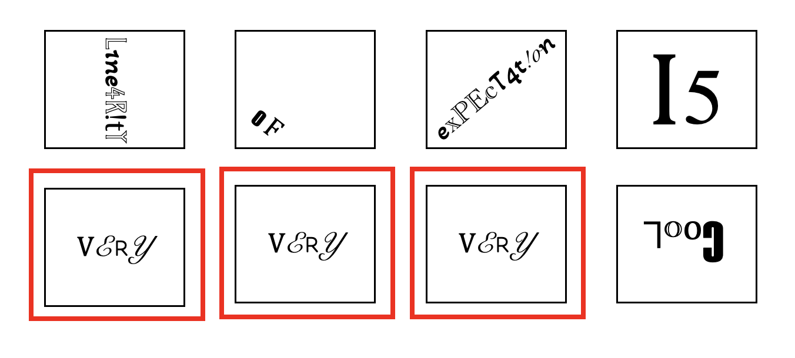
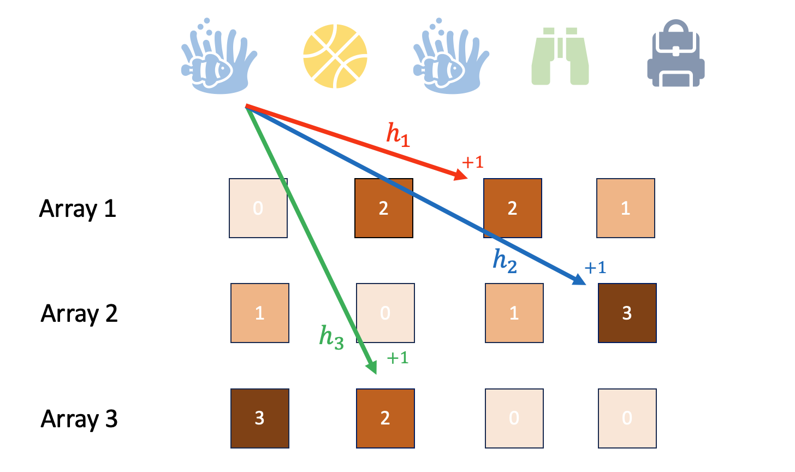

## Introduction

Powered by repeated innovations in chip manufacturing,
computers have grown exponentially more powerful over the last several decades.
As a result, we have access to unparalleled computational resources and data.
For example, a [single NASA satellite](https://www.earthdata.nasa.gov/learn/articles/swot-calibration-validation) collects 20 terabytes of satellite images,
more than 8 billion [searches](https://fitsmallbusiness.com/google-search-statistics/) are made on Google,
and [estimates](https://explodingtopics.com/blog/data-generated-per-day) suggest the internet creates more than 300 million terabytes of data *every single day*.
Simultaneously, we are quickly approaching the physical limit 
of how many transistors can be packed on a single chip.
In order to learn from the data we have and continue expanding our
computational abilities into the future,
fast and efficient algorithms are more important than ever.

At first glance, an algorithm that performs only a few operations per item
in our data set is efficient.
However, these algorithms can be too slow when we have lots and lots of data.
Instead, we turn to randomized algorithms that can run even faster.
Randomized algorithms typically exploit some source of randomness to run
on only a small part of the data set (or use only a small amount of space)
while still returning an *approximately* correct result.

We can run randomized algorithms in practice to see how well they work.
But we also want to *prove* that they work and understand why.
Today, we will solve two problems using randomized algorithms.
Before we get to the problems and algorithms, we'll build some helpful probability tools.

### Probability Background

Consider a random variable $X$.
For example, $X$ could be the outcome of a fair dice roll
and be equal to $1,2,3,4,5$ or $6$, each with probability $\frac{1}{6}$.
Formally, we use $\Pr(X=x)$ to represent the probability
that the random variable $X$ is equal to the outcome $x$.
The expectation of a discrete random variable is
$$
\mathbb{E}[X] = \sum_{x} x \Pr(X=x).
$$
For example, the expected outcome of a fair dice roll is
$\mathbb{E}[X] = 1 \times \frac{1}{6} + 2 \times \frac{1}{6} + 3 \times \frac{1}{6} +
4 \times \frac{1}{6} + 5 \times \frac{1}{6} + 6 \times \frac{1}{6} = \frac{21}{6}$.
Note: If the random variable is continuous, we can similarly define its expected value
using an integral.

The expected value tells us where the random variable is on average but
we're also interested in how closely the random variable concentrates
around its expectation.
The variance of a random variable is
$$
\textrm{Var}[X] = \mathbb{E}\left[(X - \mathbb{E}[X])^2\right].
$$
Notice that the variance is larger when the random variable 
is often far from its expectation.
In the figure below, can you identify the expected value for
each of the three distributions? Which distribution has the largest variance?
Which has the smallest?

There are a number of useful facts about the expected value and variance.
For example, 

$$
\mathbb{E}[\alpha X] = \alpha \mathbb{E}[X]
\hspace{1em} \textrm{and} \hspace{1em}
\textrm{Var}(\alpha X) = \alpha^2 \textrm{Var}(X)
$$
where $\alpha \in \mathbb{R}$ is a real number.
To see this,
observe that
$$
\mathbb{E}[\alpha X] = \sum_{x} \alpha x \Pr(X=x)
= \alpha \sum_{x} x \Pr(X=x) = \alpha \mathbb{E}[X]
$$
and 
$$
\textrm{Var}(\alpha X) = \sum_x (\alpha x - \alpha \mathbb{E}[X])^2 = \alpha^2 \sum_x ( x -  \mathbb{E}[X])^2
= \alpha^2 \textrm{Var}(X).
$$

### Independent Random Variables

Once we have defined random variables, we are often interested in events
defined on their outcomes.
Let $A$ and $B$ be two events.
For example, $A$ could be the event that the dice shows $1$ or $2$ while
$B$ could be the event that the dice shows an odd number.
We use $\Pr(A \cap B)$ to denote the probability that events $A$ and $B$ both happen.
Often, we have information about one event and want to see how that
changes the probability of another event.
We use $\Pr(A | B)$ to denote the conditional probability of event $A$ 
given that $B$ happened.
We define

$$
\Pr(A | B) = \frac{\Pr(A \cap B)}{\Pr(B)}.
$$

If information about event $B$ does not give us information about event $A$,
we say that $A$ and $B$ are independent.
Formally, events $A$ and $B$ are independent if $\Pr(A|B) = \Pr(A)$.
By the definition of conditional probability, an equivalent definition
of independence is $\Pr(A \cap B) = \Pr(A) \Pr(B)$.

Let's figure out whether the event $A$ that the dice shows 1 or 2
is independent of the event $B$ that the dice shows an odd number.
Well, $\Pr(A \cap B) = \frac{1}{6}$ since the only outcome that satisfy
both events is when the dice shows a 1.
We also know that $\Pr(A) \Pr(B) = \frac{2}{6} \times \frac{3}{6} = \frac{1}{6}$.
So, by the second definition of independence, we can conclude that
$A$ and $B$ are independent.

We've been talking about events defined on random variables, but we'll
also be interested in when random variables are independent.
Consider random variables $X$ and $Y$.
We say that $X$ and $Y$ are independent if, for all outcomes $x$ and $y$,
$\Pr(X=x \cap Y=y) = \Pr(X=x) \Pr(Y=y)$.

### Linearity of Expectation
One of the most powerful theorems in all of probability is the linearity
of expectation.

**Theorem:**
Let $X$ and $Y$ be random variables.
Then
$$
\mathbb{E}[X+Y] = \mathbb{E}[X] + \mathbb{E}[Y].
$$
The result is a powerful tool that requires *no assumptions* on the random variables.

**Proof:** Observe that
$$
\mathbb{E}[X+Y] = \sum_{x,y}(x+y) \Pr(X=x \cap Y=y)
$$
Now, we'll separate the equation into two terms and factor
out the $x$ and $y$ terms, respectively.
$$
= \sum_x x \sum_y \Pr(X=x \cap Y=y)
+ \sum_y y \sum_x \Pr(X=x \cap Y=y)
$$
Finally, using the law of total probability, we have
$$
= \sum_x x \Pr(X=x) + \sum_y y \Pr(Y=y) = \mathbb{E}[X] + \mathbb{E}[Y].
$$

There are also several other useful facts about the expected value and variance.

**Fact 1:** When $X$ and $Y$ are independent, $\mathbb{E}[XY] = \mathbb{E}[X] \mathbb{E}[Y]$.

**Proof:** Observe that 
$$
\mathbb{E}[XY] = \sum_{x,y} xy \Pr(X=x \cap Y=y)
= \sum_{x,y} xy \Pr(X=x) \Pr(Y=y)
$$

$$
= \sum_x x \Pr(X=x) \sum_y y \Pr(Y=y)
= \mathbb{E}[X] \mathbb{E}[Y]
$$
where the second equality followed by the assumption that $X$ and $Y$ are independent.

**Fact 2:**  Consider a random variable $X$. Then $\textrm{Var}(X) = \mathbb{E}[X^2] - \mathbb{E}[X]^2$.

**Proof:** Observe that 
$$
\textrm{Var}(X) = 
\mathbb{E}[(X-\mathbb{E}[X])^2]
$$
$$
= \mathbb{E}[X^2 - 2 X \mathbb{E}[X] + \mathbb{E}[X]^2]
= \mathbb{E}[X^2] - \mathbb{E}[X]^2
$$
where the first equality is by definition,
the second equality is by foiling, and
the third equality is by linearity of expectation
and the observation that $\mathbb{E}[X]$
is a scaler.

**Fact 3:** When $X$ and $Y$ are independent, $\textrm{Var}(X+Y) = \textrm{Var}(X) + \textrm{Var}(Y)$.

**Proof:** Observe that
$$
\textrm{Var}(X+Y) = \mathbb{E}[(X-Y)^2] - \mathbb{E}[X-Y]^2
$$
$$
= (\mathbb{E}[X^2] - 2\mathbb{E}[XY] + \mathbb{E}[Y^2]) - (\mathbb{E}[X]^2 -2\mathbb{E}[X] \mathbb{E}[Y] + \mathbb{E}[Y]^2)
$$
$$
= \mathbb{E}[X^2] - \mathbb{E}[X]^2 + \mathbb{E}[Y^2] - \mathbb{E}[Y]^2 = \textrm{Var}(X) + \textrm{Var}(Y)
$$
where the first equality followed by definition,
the second equality followed by foiling and linearity of
expectation, and the third equality followed
by **Fact 1**.

## Problem 1: Set Size Estimation
We'll pose a problem that has applications in ecology, social networks,
and internet indexing.
However, while efficiently solving the problem is useful, 
our purpose is really to gain familiarity with linearity of expectation
and learn Markov's inequality.

Suppose you run a website that is considering contracting with
a company to provide CAPTCHAs for login verification.
The company claims to have a database with $n=1000000$ unique CAPTCHAs.
For each API call, they'll return a CAPTCHA chosen uniformly at random
from their database.
Here's our problem:
How many queries $m$ do we need to make to their API until we can
independently verify that they do in fact have a million CAPTCHAs?

An obvious approach is to keep calling ther API until we find a million
unique CAPTCHAs.
Of course, the issue is that we have to make at least a million API calls.
That's not so good if we care about efficiency, they charge us per call,
or the size they claim to have in their database is much bigger than a million.

A more clever approach is to call their API and count duplicates.
Intuitively, the larger their database, the fewer duplicates we expect to see.
Define a random variable $D_{i,j}$ which is 1 if the 
$i$th and $j$th calls return the same CAPTCHA and 0 otherwise.
(To avoid double counting, we'll assume $i < j$.)
For example, in the figure below, the $5$th, $6$th, and $7$th calls
returned the same CAPTCHA so $D_{5,6}$, $D_{5,7}$, and $D_{6,7}$ are all 1.

When a random variable can only be 0 or 1, we call it an
*indicator* random variable.
Indicator random variables have the special property that their
expected value is the probability they are 1.
We can define the total number of duplicates $D$ in terms of
our indicator random variables $D_{i,j}$.

$$
D = \sum_{\substack{i, j \in \{1, \ldots, m\} \\ i < j }} D_{i,j}
$$

We can calculate the expected number of duplicates using linearity of expectation.

$$
\mathbb{E}[D] = \sum_{\substack{i, j \in \{1, \ldots, m\} \\ i < j }} \mathbb{E}[D_{i,j}]
$$

Since $D_{i,j}$ is an indicator random variable, we know
$\mathbb{E}[D_{i,j}]$ is the probability the $i$th and $j$th CAPTCHA are the same.
Since each API call is a uniform and independent sample from the database,
the probability the $j$th CAPTCHA is the same as the $i$th is $\frac{1}{n}$.
With this observation in hand, 

$$
\mathbb{E}[D] = \sum_{\substack{i, j \in \{1, \ldots, m\} \\ i < j }} \frac{1}{n}
= \binom{m}{2} \frac{1}{n} = \frac{m(m-1)}{2n}.
$$

Suppose we take $m=1000$ queries and see $D=10$ duplicates.
How does this compare to what we would expect if the database had $n=1000000$
CAPTCHAs?

Well, the expectation would be $\mathbb{E}[D] = \frac{1000 \times 999}{2 \times 1000000} = .4995$.
Something seems wrong... we observed many more duplicates than we expect.
Can we formalize this intuition?

### Markov's Inequality

Concentration inequalities are a powerful tool in the analysis of
randomized algorithms.
They tell us how likely it is that a random variable differs from
its expectation.

There are many concentration inequalities.
Some apply in general and some apply only under special assumptions.
The concentration inequalities that apply only under special assumptions
tend to give stronger results.
We'll start with one of the most simple and general
concentration inequalities.

**Theorem**: For any non-negative random variable $X$
and any positive threshold $t$,
$$
\Pr(X \geq t) \leq \frac{\mathbb{E}[X]}{t}.
$$

**Proof:** We'll prove the inequality directly.
By the definition of expectation, we have
$$
\mathbb{E}[X] = \sum_{x} x \Pr(X=x)
= \sum_{\substack{x \\ x \geq t}} x \Pr(X=x) + 
\sum_{\substack{x \\ x < t}} x \Pr(X=x)
$$
$$
\geq \sum_{\substack{x \\ x \geq t}} t \Pr(X=x) + 0
= t \Pr(X \geq t).
$$
Rearranging the above inequality gives Markov's.
Can you see where we used that all outcomes $x$ are non-negative?

Now let's apply Markov's inequality to our set size estimation problem.
Since the number of duplicates $D$ is always positive, we satisfy the assumption
of the inequality.
$$
\Pr(D \geq 10 ) \leq \frac{\mathbb{E}[D]}{10} = \frac{.4995}{10} = .04995
$$
The probability of observing the 10 duplicates is less than $5\%$!
We should probably start asking the CAPTCHA company some questions.

In practice, many of the set size estimation problems are slightly different.
Instead of checking a claim about the set size, we want to estimate the set
size directly.
Notice that we computed $\mathbb{E}[D] = \frac{m(m-1)}{2n}$.
Rearranging, we see that $n = \frac{m(m-1)}{2\mathbb{E}[D]}$.
Given $m$ samples, we can naturally build an estimator for the
whole set size using the empirical number of duplicates we found in the sample.
With a little more work, we can show the following.

**Claim**: If we make $m \geq c \frac{\sqrt{n}}{\epsilon}$ samples for a particular constant $c$, then
the estimate $\hat{n} = \frac{m(m-1)}{2D}$ satisfies $(1-\epsilon) n \leq \hat{n} \leq (1+\epsilon) n$ with probability $9/10$.

## Problem 2: Frequent Items

The frequent items problem is to identify the items that
appear most often in a stream.
For example, we may want to find the most popular products on Amazon,
the most watched videos on YouTube, or the most searched queries on Google.
We process each item as it appears in the stream and, at any moment, our goal
is to return the most frequent items *without* having to scan through a database.

The obvious algorithm for the frequent items problem is to store each
item and the number of times we've seen it.
The issue is that we would then need space linear in the number of unique items.
If the items are pairs of products, for example, then the space scales quadratically.
If the items are triplets of videos, then the space scales cubically.
Clearly, we need a more efficient algorithm.
It turns out that we can't solve the problem exactly with less space but
we can solve the problem *approximately*.

Consider a stream of $n$ items $x_1, \ldots, x_n$.
We'll call the set of all items in the stream $U$.
Let $k$ be a positive integer and $\epsilon > 0$ be a small constant.
The frequent items estimation problem is to return

* every item that appears at least $\frac{n}{k}$ times and

* only items that appear at least $(1-\epsilon)\frac{n}{k}$ times.

We'll see how to use a randomized hashing algorithm
to solve the problem.
The algorithm addresses the slightly different problem of
estimating the frequency of any item $v$ in the stream.
Formally, let $f(v) = \sum_{i=1}^n \mathbb{1}[x_i=v]$ be
the number of times item $v$ appears in the stream.
Here, we use the notation $\mathbb{1}[x_i=v]$ to denote the indicator random variable that the $i$th item in the stream is $v$.
An indicator random variable is 1 if the event happens and 0 otherwise.

Our goal is to return an estimate $\hat{f}(v)$ so that
$f(v) \leq \hat{f}(v) \leq f(v) + \frac{\epsilon}{k} n$
with high probability.
If we have these estimates, observe that we can can solve the frequent items
estimation problem simply by returning all items for which 
$\hat{f}(v) \geq \frac{n}{k}$.

The key ingredient of the algorithm is hash functions.

### Hash Functions
Let the hash function $h$ be a random function from the set of all items $\mathcal{U}$ to the integers $\{1,\ldots, m\}$.
The hash function is constructed using a seed of random numbers and then the function is fixed.
Given an item $x$, the hash function always returns the same hashed output $h(x)$.

**Definition:** A hash function $h: \mathcal{U} \to \{1, \ldots, m\}$ is uniform random if

* $\Pr(h(x)=i) = \frac{1}{m}$ for all items $x$ and $i \in \{1, \ldots, m\}$ and

* $h(x)$ and $h(y)$ are independent random variables for all $x,y \in U$.

Notice that the independence condition implies $\Pr(h(x)=h(y)) = \frac{1}{m}$.

In general, it is not possible to efficiently implement uniform random hash functions.
But, for our application, we only need a universal hash function which *can* be implemented efficiently.
Let $p$ be a prime number between $|\mathcal{U}|$ and $2|\mathcal{U}|$.
Choose $a,b$ randomly from $0,\ldots,p$ so that $a \neq 0$,
then define the hash function $$h(x) = (a x + b \mod p) \mod m.$$
Check out [these lecture notes](https://www.cs.princeton.edu/courses/archive/fall18/cos521/Lectures/lec1.pdf) to learn why $\Pr(h(x) = h(y)) \leq \frac{1}{m}$ for this hash function.
(As we'll soon see, this is the condition we need for the algorithm.)

### Count-Min Sketch

With handy hash functions, we're now ready to describe the algorithm.
We first choose a random hash function $h$ and initialize an $m$-length array with $0$ in every cell.
Items arrive in a stream and we hash each one to one of the $m$ cells in the array.
We then add 1 to the number in the cell.
Formally, given item $x_i$, we set $A[h(x_i)] = A[h(x_i)]+1$.

In the figure, Amazon products appear one after the other in a stream.
We hash the fish tank to the second cell in the array,
the basketball to the first cell, and so on.
Crucially, when we see the fish tank again, we hash it
to the same cell.

After processing the stream, our estimate for the frequency of item $v$ is $\hat{f}(v) = A[h(v)]$.
Notice that $\hat{f}(v) \geq f(v)$ since every time we saw item $v$, we added 1 to the corresponding cell in the array.
The inequality appears because we could have overcounted when other items hash to the same cell.

Formally, our estimate for the frequency is 
$$
\hat{f}(v) = f(v) + \sum_{y \in \mathcal{U} \setminus v} f(y) \mathbb{1}[h(y)=h(v)].
$$
Our estimate for the frequency contains the true frequency plus an error term
for all the other items that are hashed to the same cell.

Let's take the expectation of the error term:
$$
\mathbb{E}\left[\sum_{y \in U \setminus v} f(y) \mathbb{1}[h(y)=h(v)]\right]
= \sum_{y \in \mathcal{U} \setminus v} f(y) \mathbb{E}[\mathbb{1}[h(y)=h(v)]]
$$
$$
\leq \sum_{y \in \mathcal{U} \setminus v} f(y) \frac{1}{m} = \frac{1}{m} \sum_{y \in \mathcal{U} \setminus v} f(y) \leq \frac{n}{m}.
$$
We used linearity of expectation,
the special property of indicator random variables and the probability
of collisions in our hash function in the first inequality.
We used that the sum of frequencies has to sum to $n$ in the last equality.

We have a non-negative random variable and a bound on its expectation,
let's apply Markov's inequality to the error term

$$
\Pr\left( \sum_{y \in \mathcal{U} \setminus v} f(y) \mathbb{1}[h(y)=h(v)] \geq \frac{2n}{m} \right)
\leq \frac{n/m}{2n/m} = \frac{1}{2}.
$$
So we've shown that our estimate $A[h(v)]$ satisfies

$$
f(v) \leq A[h(v)] \leq f(v) + \frac{2n}{m}
$$
with probability $\frac{1}{2}$ for any $v$.
If we set $m = \frac{2k}{\epsilon}$, we can solve the problem with
error $\frac{\epsilon n}{k}$.
But our success probability is a little low, how can we improve it?

A common approach in many randomized algorithms is to boost the success
probability by repeating the core subroutine.
In our case, we'll maintain $t$ independent hash functions and arrays.

As depicted in the figure, each item gets hashed into one cell in every array
using the respective hash function.
So the update on item $x_i$ for every array $j \in \{1, \ldots, t\}$ is
$A_j[h_j(x_i)] = A_j[h_j(x_i)] + 1$.

Then, when we're computing our estimate for the frequnecy of an item,
we look at each cell it appears in and take the minimum.
Formally, $\hat{f}(v) = \min A_j[h_j(v)]$.
We take the minimum because each array only has one-sided error;
its estimate for the frequency is never *smaller* than the true frequency.
If our estimates instead had two-sided error, we would prefer
to take the mean or median.

For every array $j$ and item $v$ when we set $m=\frac{2k}{\epsilon}$,
we know that $f(v) \leq A_j[h_j(v)] \leq f(v) + \frac{\epsilon n}{k}$ with probability $\frac{1}{2}$.
Let's compute the probability that our final estimate has this much error.

$$
\Pr \left( \hat{f}(v) > f(v) + \frac{\epsilon n}{k} \right)
\leq \left( \frac{1}{2} \right)^t
$$
Call the event that the frequency estimate has error more than
$\frac{\epsilon n}{k}$ an error.
The inequality holds since our final estimate fails only if every single 
one of the arrays also independently fails.
If we set $t=\log_2{1/\delta}$ for some small constant $\delta > 0$,
then the failure probability is $\delta$.
The success probability, the complement of the failure probability, 
is $1-\delta$.

Putting it all together, we just proved that count-min sketch lets us
estimate the frequency of each item in the stream up to error
$\frac{\epsilon n}{k}$ with probability at least $1-\delta$
in $O(mt) = O(\log(1/\delta) \frac{k}{\epsilon})$ space.
The first term in the space complexity comes from the number of arrays
$t$ and the second term comes from the space per array $m$.

However, this guarantee is only *for a single* item $v$.
We really want a guarantee *for all* items.

### Union Bound

Another simple and powerful tool in randomized algorithm
design is the union bound.
The union bound allows us to easily analyze the complicated
dynamics of many random events.

**Lemma:** For any random events $E_1, E_2, \ldots, E_k$,

$$
\Pr(E_1 \cup E_2 \cup \ldots \cup E_k)
\leq \Pr(E_1) + \Pr(E_2) + \ldots + \Pr(E_k).
$$

**Proof:** We'll give a "proof by picture".
Each circle represents the outcome space corresponding to event $E_i$.
The total outcome space covered by any overlapping events is at most
the outcome space covered by the events if they were to not overlap.

Let's apply the union bound to the total failure probability of our estimate.
The algorithm fails if $\hat{f}(v_i) > \frac{\epsilon n }{k}$ for
any item $v_i$.
By the union bound,
$$
\Pr \left( 
\textrm{fail for } v_1
\cup \textrm{fail for } v_2
\cup \ldots \cup
\textrm{fail for } v_{|\mathcal{U}|}
\right)
$$
$$
\leq \Pr(\textrm{fail for } v_1)
+ \Pr(\textrm{fail for } v_2)
+ \ldots +
\Pr(\textrm{fail for } v_{|\mathcal{U}|})
$$
$$
= \delta + \delta + \ldots + \delta = |\mathcal{U}| \delta \leq n \delta.
$$
Let's set $\delta=\frac{1}{10n}$.
With probability $9/10$, count-min sketch lets us estimate the frequency of all
items in a stream up to error $\frac{\epsilon n}{k}$.
Recall this is is accurate enough to solve the frequent items estimation problem if
we just return all items $v$ with estimated frequency at least $\frac{n}{k}$.

