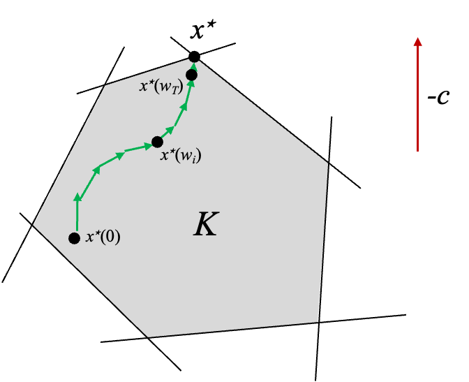

Recall the standard optimization setting.
We are given a function $f:\mathbb{R}^d \to \mathbb{R}$ to minimize, a function oracle and a gradient oracle.
The function oracle returns $f(\mathbf{x})$ and the gradient oracle returns $\nabla f(\mathbf{x})$ for any input $\mathbf{x} \in \mathbb{R}^d$.
The goal is to minimize the number of calls to the oracles to find an output $\hat{\mathbf{x}}$ such that $$f(\hat{\mathbf{x}}) \leq \min_{\mathbf{x}} f(\mathbf{x}) + \epsilon$$ for $\epsilon > 0.$

In machine learning applications, the function $f$ is typically a loss function defined for a particular training dataset.
Today, we'll discuss the online setting where the dataset changes over time. Examples of the online setting include:

* Spam filters that are incrementally updated as new types of spam emails are developed.

* Text recommendation engines like Github Copilot that need to be updated as software libraries change.

* Content recommendation systems that need to adapt to user behavior and clicks over time.

* Image recognition systems such as iNaturalist that are updated with user expertise.

## Online Learning

Consider a model $M_\mathbf{x}$ parameterized by parameters $\mathbf{x}$.
We want to find good parameters to minimize a loss function $\ell$ but the data we are optimizing with respect to is changing over time.
At each step $t=1,\ldots,T$, we receive data vectors $\mathbf{a}^{(1)}, \ldots, \mathbf{a}^{(T)}$.
For each step $t$, we choose a parameter vector $\mathbf{x}^{(t)}$.
After we make the prediction $\hat{y}^{(t)} = M_{\mathbf{x}^{(t)}}(\mathbf{a}^{(t)})$, we receive the true label $y^{(t)}$.
We then use the information to choose the new parameter vector $\mathbf{x}^{(t+1)}$ for the next time step.
The goal is to minimize the cumulative loss
$$
\mathcal{L} = \sum_{t=1}^T \ell(\hat{y}^{(t)}, y^{(t)}).
$$
This framework works for many loss functions and models.
One popular setting is linear regression where
$$
\ell(\hat{y}^{(t)}, y^{(t)}) = 
||\langle \mathbf{x}^{(t)}, \mathbf{a}^{(t)} \rangle - y^{(t)}||^2.
$$
If the model was a neural network, we could update the model to make it more complicated.
If the task was classification, we could use cross-entropy loss.

Let's abstract the online setting and analyze it.
Instead of a single objective function with different data points, we have a sequence of objective functions $f^{(1)}, \ldots, f^{(T)}: \mathbb{R}^d \to \mathbb{R}$.
For time step $t=1,\ldots, T$, we select a vector $\mathbf{x}^{(t)} \in \mathbb{R}^d$.
We then observe $f_t$ and pay cost $f_t(\mathbf{x}^{(t)})$.
The goal is to minimize the total cost
$$
\sum_{t=1}^T f_t(\mathbf{x}^{(t)}).
$$

In the offline optimization setting, we wanted to find parameters $\hat{\mathbf{x}}$ that approximately minimized the function $f$.
We will ask for a similar guarantee in the online setting.
We want to choose parameters $\mathbf{x}^{(1)}, \ldots, \mathbf{x}^{(T)}$ such that
$$
\sum_{t=1}^T f_t(\mathbf{x}^{(t)})
\leq \left( \min_{\mathbf{x}} \sum_{t=1}^T f_t(\mathbf{x}) \right) + \epsilon.
$$
Amazingly, we will make no assumptions that $f_1, \ldots, f_T$ are related to each other at all!

In the online setting, the error $\epsilon$ is called the *regret* of our solution sequence $\mathbf{x}^{(1)}, \ldots, \mathbf{x}^{(T)}$.
Notice that the regret compares our solution sequence to the best fixed parameter in hindsight.
Typically, we want $\epsilon$ to grow sublinearly in $T$ so that the average regret goes to $0$ as the number of iterations increases.

A surprising characteristic of the formulation is that the solution sequence could actually give a better solution than the best fixed parameter in hindsight.
Perhaps we could hope for a stronger gurantee such as
$$
\sum_{t=1}^T f_t(\mathbf{x}^{(t)})
\leq \left( \sum_{t=1}^T \min_{\mathbf{x}} f_t(\mathbf{x}) \right) + \epsilon.
$$
The second guarantee differs from the first guarantee in that we are comparing our solution sequence to the optimal solution sequence that can vary wildly from one time step to the next.

Unfortunately, the above guarantee is not possible in general.
Consider convex functions 
$$
f_{t}(x) = | x- h_t|
$$
where $h_t$ is a sequence of random numbers sampled uniformly from 0 to 1.
The right hand side of the above inequality is $0$ since a optimal dynamic sequence can always select $x^{(t)} = h_t$.
However, the left hand side is $\Omega(T)$ since the online solution must pay $|x^{(t)} - h_t|$ at each time step.
(Because $h_t$ is random, the online solution cannot predict $h_t$ with average error less than $\frac12$.)

So we'll settle for the first, weaker guarantee that
$$
\sum_{t=1}^T f_t(\mathbf{x}^{(t)})
\leq \left( \min_{\mathbf{x}} \sum_{t=1}^T f_t(\mathbf{x}) \right) + \epsilon.
$$
There is a beautiful balance in the guarantee:
If $f_1, \ldots, f_T$ are similar, we can learn to predict $f_t$ well and we can hope for a small $\epsilon$.
On the other hand, if $f_1, \ldots, f_T$ are different, we can't hope for a small $\epsilon$ but $\min_{\mathbf{x}} \sum_{t=1}^T f_t(\mathbf{x})$ will be large.
Often times, we will be in the middle of the two extremes.

Consider the following simple algorithm for the online problem.
We start by choosing an initial parameter vector $\mathbf{x}^{(0)}$. 
Then for $t=1,\ldots, T$, we choose
parameters
$$
\mathbf{x}^{(t)}
= \arg \min_\mathbf{x}
\sum_{j=1}^{t-1} f_{j_t}(\mathbf{x}).
$$
The above algorithm is called *follow the leader*.
While it is simple and intuitive, the algorithm has two issues: one is related to computational complexity and one is related to accuracy.
In terms of computations, the algorithm requires us to solve a convex optimization problem with on average $O(T)$ terms at each time step for total of $O(T^2)$ complexity.
In terms of accuracy, the algorithm can overfit to the data.
Consider the figure below where we are alternately given functions $f_a$ and $f_b$.
If we optimize after receiving slightly more $f_a$ functions, then we will overfit to $f_a$ and do poorly on $f_b$ exactly when we need to do well on $f_b$.

Luckily, we already know an algorithm which can be modified to address both issues.

## Online Gradient Descent
Online gradient descent is a modification of gradient descent for the online setting.
As in the offline setting, we choose initial parameters $\mathbf{x}^{(1)}$ and learning rate $\eta$.
Then for $t=1,\ldots, T$, we use parameters $\mathbf{x}^{(t)}$.
We then observe $f_t$ and pay cost $f_t(\mathbf{x}^{(t)})$.
Next, we update the parameter with the gradient of $f_t$:
$$
\mathbf{x}^{(t+1)} = \mathbf{x}^{(t)} - \eta \nabla f_t(\mathbf{x}^{(t)}).
$$
Notice that if all the $f_t$ are the same, the online gradient algorithm is the same as regular gradient descent.

Let
$$
\mathbf{x}^* = \arg \min_\mathbf{x}
\sum_{t=1}^T f_t(\mathbf{x}).
$$
We will show that online gradient descent achieves low regret with respect to the optimal fixed solution $\mathbf{x}^*$ under our favorite assumptions.

**Regret Bound:**
Suppose that $f_1, \ldots, f_T$ are convex, $G$-Lipschitz, and the gradients are $L$-Lipschitz.
Then, after $T$ steps, the regret is
$$
\epsilon =  \sum_{t=1}^t f_t(\mathbf{x}^{(t)})  -  \sum_{t=1}^T f_t(\mathbf{x}^*))
\leq RG \sqrt{T}.
$$

Notice that the *average* regret is bounded by $\frac{RG}{\sqrt{T}}$.
As the number of steps increases, the average regret goes to $0$.

The amazing property of this result is that we made no assumptions on how $f_1, \ldots, f_T$ are related to each other.
In fact, the functions could have even been chosen adversarily so that $f_t$ depends on $\mathbf{x}^{(1)}, \ldots, \mathbf{x}^{(t-1)}$.

Similar to the offline setting, we will show the result with the following intermediate claim.
For all $t=1,\ldots, T$, we have
$$
f_t(\mathbf{x}^{(t)}) - f_t(\mathbf{x}^*)
\leq \frac{ \| \mathbf{x}^{(t)} - \mathbf{x}^* \|_2^2 - \| \mathbf{x}^{(t+1)} - \mathbf{x}^* \|_2^2}{2 \eta} + \frac{\eta G^2}{2}.
$$
The proof is actually the same as for the offline setting; we only use the convexity of the functions $f_t$.
Next, we'll apply a telescoping sum to get
\begin{align*}
\sum_{t=1}^T f_t(\mathbf{x}^{(t)}) - f_t(\mathbf{x}^*)
&\leq \frac{ \| \mathbf{x}^{(1)} - \mathbf{x}^* \|_2^2 - \| \mathbf{x}^{(T+1)} - \mathbf{x}^* \|_2^2}{2 \eta} + \frac{\eta TG^2}{2} \\
&\leq \frac{R^2}{2\eta} + \frac{\eta TG^2}{2}
= RG\sqrt{T}
\end{align*}
where the equality follows by our choice of $\eta = \frac{R}{G\sqrt{T}}$.

With the online gradient descent bound in hand, we will apply it to analyze the performance of stochastic gradient descent.

## Stochastic Gradient Descent

In machine learning applications, we often want to minimize a function $f$ that is a sum of many functions
$$
f(\mathbf{x}) = \sum_{i=1}^n f_i(\mathbf{x}).
$$
Typically, each function $f_i$ is a loss function for a single data point.

Stochastic gradient descent is a modification of gradient descent that takes advantage of the finite sum structure to speed up the algorithm when there are patterns in the data.

The key insight of stochastic gradient descent is that we can approximate the gradient of $f$ by sampling a single function $f_j$.
To see this, observe that
$$
\nabla f(\mathbf{x}) = \sum_{i=1}^n \nabla f_i(\mathbf{x}).
$$
We will pick a random $j \in \{1,\ldots, n\}$ and then use the gradient $\nabla f_{j}$ to update our parameters.
Notice that, by the definition of expectation,
$$
\mathbb{E}[ \nabla f_{j}(\mathbf{x}) ] =
\sum_{i=1}^n \frac1{n} \nabla f_{i}(\mathbf{x}) = \frac1{n} \nabla f(\mathbf{x}).
$$

Then $n \nabla f_{j_t}(\mathbf{x})$ is an unbiased estimator of $\nabla f(\mathbf{x})$.
The advantage is that we can typically compute $\nabla f_{j_t}(\mathbf{x})$ in $1/n$ fraction of the time it takes to compute $f(\mathbf{x})$.
Stochastic gradient trades slower convergence for cheaper iterations.

The stochastic gradient descent algorithm is as follows.
Choose a staring vector $\mathbf{x}^{(1)}$ and learning rate $\eta$.
For $t=1,\ldots, T$, we pick a random $j_t \in \{1,\ldots, n\}$ uniformly at random.
Then we update the parameters like so
$$
\mathbf{x}^{(t+1)} = \mathbf{x}^{(t)} - \eta \nabla f_{j_t}(\mathbf{x}^{(t)}).
$$
At the end of the algorithm, we return the average parameters
$$
\hat{\mathbf{x}} = \frac1{T} \sum_{t=1}^T \mathbf{x}^{(t)}.
$$
The reason we return the average parameters at the end is because we don't want to spend time evaluating the full function to learn which parameters are best.

<!---

Loss by iteration for gradient descent and stochastic gradient descent on the MNIST data set.
--->

We will analyze stochastic gradient descent as a special case of online gradient descent.
Consider the finite sum structure $f(\mathbf{x}) = \sum_{i=1}^n f_i(\mathbf{x})$ where each $f_i$ is convex.
In addition, we assume that each $f_i$ is Lipschitz with constant $\frac{G'}{n}$.
Notice that this assumption implies that $f$ is $G'$-Lipschitz.
We will view the stochastic gradient descent algorithm as an online algorithm where we are given the functions $f_1, \ldots, f_n$.

We will use the following inequality in the analysis.

**Jensen's Inequality:**
For a convex function $f$ and points $\mathbf{x}^{(1)}, \ldots, \mathbf{x}^{(T)}$, we have
$$
f\left(\frac1{T} \mathbf{x}^{(1)} + \ldots + \frac1{T} \mathbf{x}^{(T)} \right)
\leq \frac1{T}
f(\mathbf{x}^{(1)}) + \ldots + \frac1{T} f(\mathbf{x}^{(T)}).
$$

**Stochastic Gradient Descent Convergence:**
We will show that after $T=\frac{R^2 G'^2}{\epsilon^2}$ steps, we have
$$
\mathbb{E}[f(\hat{\mathbf{x}}) - f(\mathbf{x}^*)]
\leq \epsilon.
$$

First, we have that
\begin{align*}
f(\hat{\mathbf{x}}) - f(\mathbf{x}^*)
&=
f\left(\frac1{T} \sum_{t=1}^T \mathbf{x}^{(t)}\right) - \frac1{T} \sum_{t=1}^T f(\mathbf{x}^*) \\
&\leq \frac1{T} \sum_{t=1}^T f(\mathbf{x}^{(t)}) - \frac1{T} \sum_{t=1}^T f(\mathbf{x}^*) \\
&= \frac1{T} \sum_{t=1}^T f(\mathbf{x}^{(t)}) - f(\mathbf{x}^*)
\end{align*}
where the inequality follows by Jensen's inequality.

We will consider the prior inequality in expectation.
Then
\begin{align*}
\mathbb{E}[f(\hat{\mathbf{x}}) - f(\mathbf{x}^*)]
&\leq \frac{1}{T} \sum_{t=1}^T \mathbb{E}[f(\mathbf{x}^{(t)}) - f(\mathbf{x}^*)] \\
&= \frac1{T} \sum_{t=1}^T n \mathbb{E}[f_{j_t}(\mathbf{x}^{(t)}) - f_{j_t}(\mathbf{x}^*)] \\
&= \frac{n}{T} \sum_{t=1}^T \mathbb{E}[f_{j_t}(\mathbf{x}^{(t)}) - f_{j_t}(\mathbf{x}^*)].
\end{align*}
Consider the best offline solution 
$$
\mathbf{x}^{\text{offline}} = 
\arg \min_\mathbf{x} \sum_{t=1}^T f_{j_t}(\mathbf{x}).
$$
Notice that
$$
\sum_{t=1}^T f_{j_t}(\mathbf{x}^{\text{offline}})
\leq \sum_{t=1}^T f_{j_t}(\mathbf{x}^*)
$$
by definition.
Then, combining the last two inequalities, we have
\begin{align*}
\mathbb{E}[f(\hat{\mathbf{x}}) - f(\mathbf{x}^*)]
&\leq \frac{n}{T} \sum_{t=1}^T \mathbb{E}[f_{j_t}(\mathbf{x}^{(t)}) - f(\mathbf{x}^\text{offline})] \\
&\leq \frac{n}{T} \left( R \frac{G'}{n} \sqrt{T} \right)
\end{align*}
where the last inequality follows by the online gradient descent guarantee.

Let's compare our guarantees from gradient descent and stochastic gradient descent.
For gradient descent, we can find an $\epsilon$ minimizer in $T=\frac{R^2 G^2}{\epsilon^2}$ steps.
For stochastic gradient descent, we can find a $\epsilon$ minimizer in $T=\frac{R^2 G'^2}{\epsilon^2}$ steps.

We always have $G \leq G'$ since
\begin{align*}
\max_{\mathbf{x}} \| \nabla f(\mathbf{x}) \|_2
&\leq \max_{\mathbf{x}} \sum_{i=1}^n \| \nabla f_i(\mathbf{x}) \|_2 \\
&\leq \sum_{i=1}^n \max_{\mathbf{x}} \| \nabla f_i(\mathbf{x}) \|_2 \\
&\leq n \frac{G'}{n} = G'.
\end{align*}
So gradient descent converges strictly faster than stochastic gradient descent.
However, for a fair comparison, we should analyze the complexity of each algorithm.
For gradient descent, the complexity is $T \cdot O(n)$ since each of the $T$ iterations requires us to compute the gradient of $f$ which is a sum of $n$ functions.
For stochastic gradient descent, the complexity is $T \cdot O(1)$ since each of the $T$ iterations requires us to compute the gradient of a single function.

When $G \ll G'$, gradient descent will perform better than stochastic gradient descent.
When $G$ is closer to $G'$, stochastic gradient descent will perform better.
An extreme case when $G = G'$ is when $f$ is a sum of $n$ identical functions.

Let's consider the case of unstructured data where the gradients look like random vectors.
That is, each entry of $\nabla f_i(\mathbf{x})$ is a standard normal random variable.
The expected norm of the gradient of a single function is
\begin{align*}
\mathbb{E}[\| \nabla f_i(\mathbf{x}) \|_2^2]
= \mathbb{E}  \left[
\sum_{j=1}^d n_{ij}^2 \right]
= d
\end{align*}
since each $n_{ij}$ has variance $1$ and mean $0$.
The expected norm of the gradient of the whole function is
\begin{align*}
\mathbb{E}[\| \nabla f(\mathbf{x}) \|_2^2]
= \mathbb{E} \left[ \left\|
\sum_{i=1}^n \nabla f_i(\mathbf{x}) \right\|_2^2 \right]
= dn
\end{align*}
since each $\left[\sum_{i=1}^n f_i(\mathbf{x})\right]_j$ has variance $n$ and mean $0$.

From the analysis, we can see that random gradients are a worst case scenario for stochastic gradient descent.
Generally, stochastic gradient performs better when there is more structure in the data.
Luckily,
structured data sets such as MNIST (shown below) are standard in machine learning.

## Preconditioning

Instead of minimizing $f$, the idea of preconditioning is to find another function $g$ which is better suited for first order optimization but has the same minimizer as $f$.

**Claim:**
Let $h: \mathbb{R}^d \to \mathbb{R}^d$ be an *invertible function*.
Let $g(\mathbf{x}) = f(h(\mathbf{x}))$.
Then
$$
\min_\mathbf{x} f(\mathbf{x}) = \min_\mathbf{x} g(\mathbf{x}).
$$

**Proof:**
Let $\mathbf{x}_g^* = \arg \min_\mathbf{x} g(\mathbf{x})$
and $\mathbf{x}_f^* = \arg \min_\mathbf{x} f(\mathbf{x})$.
Then 
\begin{align*}
\min_\mathbf{x} f(\mathbf{x}) \leq f(h(\mathbf{x}_g^*)) = g(\mathbf{x}_g^*)
\end{align*}
and
\begin{align*}
\min_\mathbf{x} g(\mathbf{x}) \leq g(h^{-1}(\mathbf{x}_f^*)) 
= f(h(h^{-1}(\mathbf{x}_f^*)))
= f(\mathbf{x}_f^*).
\end{align*}

Since $\min_\mathbf{x} f(\mathbf{x}) \leq \min_\mathbf{x} g(\mathbf{x})$ and $\min_\mathbf{x} g(\mathbf{x}) \leq \min_\mathbf{x} f(\mathbf{x})$, the claim follows.

In order to optimize the function efficiently, we require that $g$ is convex.
Often, we choose a linear function $h$ so $g$ is convex if $f$ is convex.
In particular,
let $\mathbf{P}$ be an invertible $d \times d$ matrix.
So the preconditioner is given by $g(\mathbf{x}) = f(\mathbf{P} \mathbf{x})$.

There are several additional goals we consider.

* We want $g$ to be better conditioned (e.g. smooth and strongly convex) than $f$.

* We want to be able to compute $\mathbf{P}$ and $\mathbf{P}^{-1}$ efficiently.

It is often the case that $\mathbf{P}$ is chosen to be a diagonal matrix.
For example, let's consider linear regression where $\| \mathbf{Ax} - \mathbf{b} \|_2^2$$ is the loss function, a common choice of preconditioner is $\mathbf{P} = \text{diag}(\mathbf{A}^T \mathbf{A})^{-1}$.

We can think of preconditioning as variable step sizes.
If $g(\mathbf{x}) = f(\mathbf{Px})$ then $\nabla g(\mathbf{x}) = \mathbf{P}^\top \nabla f(\mathbf{Px})$.

If we run gradient descent on $g$, the update is
$$
\mathbf{x}^{(t+1)} = \mathbf{x}^{(t)} - \eta \mathbf{P}^\top \nabla f(\mathbf{Px}^{(t)}).
$$

Multiply by $\mathbf{P}$ on both sides and let $\mathbf{y}^{(t)} = \mathbf{Px}^{(t)}$.
Then the update is
$$
\mathbf{y}^{(t+1)} = \mathbf{y}^{(t)} - \eta \mathbf{P}^2 \nabla f(\mathbf{y}^{(t)}).
$$

When $\mathbf{P}$ is a diagonal matrix, the reformulation in terms of $\mathbf{y}$ is just gradient descent with a different step size for each parameter.

There are many algorithms based on the idea of preconditioning including AdaGrad, RMSprop, and the Adam optimizer.

## Dimension Dependent Optimization

When we analyzed first order optimization, we were able to get a bound on the *iteration complexity* that did not depend on the dimension $d$.
However, each iteration required us to compute the gradient which is linear in the dimension.

Alternatively, we can get much better bounds on the number of oracle calls if we are willing to depend on the problem dimension.
We actually can already see how to do this in the case of linear regression.

**Linear Regression Example:**
Consider the function $f(\mathbf{x}) = \frac12 \| \mathbf{Ax} - \mathbf{b} \|_2^2$.
We know the gradient is given by
$$\nabla f(\mathbf{x}) = \mathbf{A}^\top (\mathbf{Ax} - \mathbf{b}) = \mathbf{A}^\top \mathbf{Ax } - \mathbf{A}^\top \mathbf{b}$$
and the optimal solution is given by
$$
\mathbf{x}^* = (\mathbf{A}^\top \mathbf{A})^{-1} \mathbf{A}^\top \mathbf{b}.
$$

We can find the optimal solution with $d+1$ calls to the gradient oracle.
For the first call, query $\nabla f(\mathbf{0}) = - \mathbf{A}^\top \mathbf{b}$.
Then for the remaining calls $i \in \{1, \ldots, d\}$, query the standard basis vector $\mathbf{e}_i$.
We can then recover the $i$th column of $\mathbf{A}^\top \mathbf{A}$ since 
$$
f(\mathbf{e}_i) + \mathbf{A}^\top \mathbf{b}
= \mathbf{A}^\top \mathbf{A} \mathbf{e}_i.
$$

Once we have $\mathbf{A}^\top \mathbf{A}$, we can invert it (in $O(d^3)$ time but without any oracle calls) and multiply it by $\mathbf{A}^\top \mathbf{b}$ to recover the optimal solution $\mathbf{x}^*$.

We will now analyze a general algorithm for convex optimization that depends on the dimension $d$.

**Dimension Dependent Convex Optimization:**
Consider a function $f$ bounded between $[-B, B]$ on a convex set $\mathcal{S}$.
The center of gravity algorithm outputs a solution $\hat{\mathbf{x}}$ such that
$$
f(\hat{\mathbf{x}}) \leq  f(\mathbf{x}^*) + \epsilon
$$
using $O(d \log(B/\epsilon))$ calls to a function and gradient oracle for convex function $f$.

One caveat of the algorithm is that we need some representation of $\mathcal{S}$, not just a projection oracle.

The center of gravity algorithm is a natural cutting plane method.
Interestingly, it was developed simultaneously on opposite sides of the iron curtain by A. Y. Levin in the Soviet Union and D. J. Newman in the United States both in 1975.
The algorithm is not used in practice (we will discuss why) but the basic idea underlies many popular algorithms.

The center of gravity algorithm uses two basic ingredients.
First,
the center of gravity of a convex set $\mathcal{S}$ is defined as
$$
c = \frac{\int_{x \in \mathcal{S}} x \, dx}{\text{vol}(\mathcal{S})}
= \frac{\int_{x \in \mathcal{S}} x \, dx}{\int_{x \in \mathcal{S}} 1 dx}.
$$
Second, for two convex sets $\mathcal{A}$ and $\mathcal{B}$, the intersection $\mathcal{A} \cap \mathcal{B}$ is also convex.
To see this,
consider two points $\mathbf{x}, \mathbf{y} \in \mathcal{A} \cap \mathcal{B}$.
Then for any $\lambda \in (0,1)$, we have
$$
\lambda \mathbf{x} + (1-\lambda) \mathbf{y} \in \mathcal{A}
$$
because $\mathbf{x,y}$ are in $\mathcal{A}$
and
$$
\lambda \mathbf{x} + (1-\lambda) \mathbf{y} \in \mathcal{B}
$$
because $\mathbf{x,y}$ are in $\mathcal{B}$.

The center of gravity algorithm is as follows.
Instantiate $\mathcal{S}_1 = \mathcal{S}$.
For each step $t=1, \ldots, T$,
let $\mathbf{c}_t$ be the center of gravity of $\mathcal{S}_t$.
We will then compute $\nabla f(\mathbf{c}_t)$.
Now define 
$$
\mathcal{H} = \{ \mathbf{x} \in \mathbb{R}^d : \langle \mathbf{x} - \mathbf{c}_t, \nabla f(\mathbf{c}_t) \rangle \leq 0 \}.
$$
Then update $\mathcal{S}_{t+1} = \mathcal{S}_t \cap \mathcal{H}$.
Finally, return the best solution $\hat{\mathbf{x}} = \arg \min_{t} f(\mathbf{c}_t)$.

An iteration is described graphically below.
The entire blue area is the convex set $\mathcal{S}_1$.
The center of gravity of $\mathcal{S}_1$ is $\mathbf{c}_1$.
We compute the gradient of $f$ with at $\mathbf{c}_1$ and define the halfspace $\mathcal{H}$ as everything in the direction of *descent*.
Then the next convex set $\mathcal{S}_2$ is the intersection of $\mathcal{S}_1$ and $\mathcal{H}$.

By convexity,
$$
f(\mathbf{y}) \geq f(\mathbf{c}_t) + \langle \mathbf{y} - \mathbf{c}_t, \nabla f(\mathbf{c}_t) \rangle.
$$
If $\mathbf{y} \notin \{ \mathcal{S}_t \cap \mathcal{H} \}$, then
$\langle \nabla f(\mathbf{c}_t), \mathbf{y} - \mathbf{c}_t \rangle$ is positive so
$f(\mathbf{y}) > f(\mathbf{c}_t)$.

**Center of Gravity Convergence:**
Let $f$ be a convex function with values in $[-B, B]$ on a convex set $\mathcal{S}$.
Then the center of gravity algorithm outputs a solution $\hat{\mathbf{x}}$ after $T$ iterations such that 

\begin{align*}
f(\hat{\mathbf{x}}) - f(\mathbf{x}^*)
\leq 2B \left( 1- \frac1{e} \right)^{T/d}
\leq 2B \exp \left( - \frac{T}{3d} \right).
\end{align*}
If we set $T = 3d \log(B/\epsilon)$, then we have $f(\hat{\mathbf{x}}) - f(\mathbf{x}^*) \leq \epsilon$.

We want to argue that, at every step of the algorithm, we "cut off" a large portion of the convex set we are searching over.

**Grunbaum's Theorem:**
For any convex set $\mathcal{S}$ with center of gravity $\mathbf{c}$ and any halfspace $\mathcal{Z}= \{\mathbf{x} | \langle \mathbf{a}, \mathbf{x} - \mathbf{c} \rangle \leq 0 \}$, we have

$$
\frac{\text{vol}(\mathcal{S} \cap \mathcal{Z})}{\text{vol}(\mathcal{S})}
\geq \frac{1}{e}.
$$

The extreme case of the inequality is given by a triangle.

Let $\mathcal{Z}$ be the complement of $\mathcal{H}$ from the algorithm.
Then, by Grunbaum's Theorem, we cut off at least a $1/\epsilon$ fraction of the convex body on every iteration.
After $t$ steps,
we have
$$
\text{vol}(\mathcal{S}_t) \leq \left(1-\frac1{\epsilon}\right)^t
\text{vol}(\mathcal{S}).
$$

To connect the result to the proof of the convergence bound,
let $\delta > 0$ be a small parameter to be set later.
Now define
$\mathcal{S}^\delta = \{ (1-\delta) \mathbf{x}^* + \delta \mathbf{x} : \mathbf{x} \in \mathcal{S} \}$.

**Claim:**
Every point $\mathbf{y}$ in $\mathcal{S}^\delta$ has good function value.
To see this, observe that we have
\begin{align*}
f(\mathbf{y}) &= f((1-\delta) \mathbf{x}^* + \delta \mathbf{x}) \\
&\leq (1-\delta) f(\mathbf{x}^*) + \delta f(\mathbf{x}) \\
&\leq f(\mathbf{x}^*) - \delta f(\mathbf{x}^*) + \delta f(\mathbf{x}) \\
& \leq f(\mathbf{x}^*) + 2B\delta
\end{align*}
where the first inequality follows by Jensen's inequality.

We also have that $\text{vol}(\mathcal{S}^\delta) = \delta^d \text{vol}(\mathcal{S})$.
Set $\delta = (1-\frac1{e})^{T/d}$.
After $T$ steps, we have
\begin{align*}
\text{vol}(\mathcal{S}_t) \leq (1-\frac1{e})^T \text{vol}(\mathcal{S}).
\end{align*}

Either:

* $\mathcal{S}_t$ exactly equals $S^\delta$ in which case our next centroid gives error $2B \delta$ or

* we must have "chopped off" at least one point $\mathbf{y} \in \mathcal{S}^\delta$ be the time we reach step $T$.

If we have chopped off at least one point in $\mathbf{y} \in \mathcal{S}^\delta$ by the time we reach step $T$, then we have for some centroid $t$, $f(\mathbf{c}_t) < 2B \delta$.

To see this, observe that
$$
2 B \delta \geq f(\mathbf{y}) \geq f(\mathbf{c}_t) + \langle \nabla f(\mathbf{c}_t), \mathbf{y} - \mathbf{c}_t \rangle > f(\mathbf{c}_t)
$$
since we require that every point $\mathcal{y}$ in the next convex set $\mathcal{S}_{t+1}$ satisfies $\langle \nabla f(\mathbf{c}_t), \mathbf{y} - \mathbf{c}_t \rangle \leq 0$.

In terms of gradient oracle complexity, the algorithm is essentially optimal.
However, the algorithm is not widely used in practice.
The reason is that computing the centroid is hard.
In fact, computing the centroid is $\#$P-hard even when $\mathcal{S}$ is an intersection of halfspaces.

Even if the problem isn't hard for the starting convex body $\mathcal{S}$, it likely will become hard for the convex body $\mathcal{S} \cap \mathcal{H}_1 \cap \mathcal{H}_2 \cap \ldots \cap \mathcal{H}_T$.

We will now discuss how to obtain a computationally efficient version of the center of gravity algorithm called the ellipsoid method.
The ellipsoid method is most famous for giving the first polynomial time algorithm for linear programming.

## Ellipsoid Method

We'll consider a slightly more general problem.
Given a convex set $\mathcal{K}$ via access to a separation oracle $S_\mathcal{K}$ for the set, we want to determine if $\mathcal{K}$ is empty or, otherwise, return any p oint $\mathbf{x} \in \mathcal{K}$.

Formally, the separation oracle returns
$$
S_\mathcal{K}(\mathbf{y}) = 
\begin{cases}
\emptyset & \text{if } \mathbf{y} \in \mathcal{K} \\
\text{separating hyperplane} \mathcal{H} & \text{if } \mathbf{y} \notin \mathcal{K}.
\end{cases}
$$

The hyperplane is parameterized by a normal vector $\mathbf{a}$ and offset $c$
so $\mathcal{H} = \{ \mathbf{x} : \langle \mathbf{a}, \mathbf{x} \rangle \leq c \}$.

Let's consider an example.

**Separation Oracle Example:**
How would we implement a separation oracle for a polytope $\{ \mathbf{x} : \mathbf{Ax} \geq \mathbf{b} \}$?
Here, $\mathbf{x} \in \mathbb{R}^d$, $\mathbf{A} \in \mathbb{R}^{m \times d}$, and $\mathbf{b} \in \mathbb{R}^m$.

The polytope is specified by a sequence of equations
\begin{align*}
\mathbf{a}_1^\top \mathbf{x} &\geq b_1 \\
\mathbf{a}_2^\top \mathbf{x} &\geq b_2 \\
\vdots \\
\mathbf{a}_m^\top \mathbf{x} &\geq b_m
\end{align*}
where $\mathbf{a}_i$ is the $i$th row of $\mathbf{A}$ and $b_i$ is the $i$th entry of $\mathbf{b}$.
We can check each equation to see if it is satisfied by $\mathbf{x}$ in $O(d)$ time per equation.
If all the equations are satisfied, we return $\emptyset$.
If there is some equation $i$ that is not satisfied, we return the corresponding hyperplane $\mathcal{H} = \{ \mathbf{x} : \mathbf{a}_i^\top \mathbf{x} = b_i \}$.

Recall our original problem is to find
$$
\min_\mathbf{x} f(\mathbf{x}) \text{ subject to } \mathbf{x} \in \mathcal{K}.
$$

How can we reduce the original problem to determining if a convex set $\mathcal{K}$ is empty or not?

The answer is binary search!
For a convex function $f$, the set $\{ \mathbf{x} : f(\mathbf{x}) \leq c \}$ is convex.
In addition, we can get a separation oracle via the gradient of $f$.
We start with an upper and lower bound $u$ and $l$ on the optimal solution.
We will check if the convex set
$$
\mathcal{S} \cap \{ \mathbf{x} : f(\mathbf{x}) \leq (u+l)/2 \}
$$
contains a point.
We will update $u = (u+l)/2$ if it does and $l = (u+l)/2$ if it does not.
We continue until $u-l \leq \epsilon$.

The goal of the ellipsoid method is to determine whether a convex set $\mathcal{K}$ is empty or not given a separation oracle.
We will assume that:

1. $\mathcal{K}$ is bounded by a ball of radius $R$ centered at some point $\mathbf{c}_R$.

2. If $\mathcal{K}$ is nonempty, then it contains a ball of radius $r$ centered at some point $\mathbf{c}_r$ for some $r < R$.

We can apply the solution to the original problem with the following observation:
For a convex function $f$ such that $\| \nabla f(\mathbf{x}) \|_2 \leq G$ for all $\mathbf{x}$, it can be checked that the convex set $\{\mathbf{x} : f(\mathbf{x}) \leq \epsilon \}$ contains a ball ofo radius $\epsilon/G$.

We'll now sketch the ellipsoid method.
The ellipsoid method is an iterative algorithm that is similar to the center of gravity algorithm.
We will:

1. Check if the center $\mathbf{c}_R$ of  the ball with radius $R$ is in the current ellipsoid is in $\mathcal{K}$.

2. If it is, then we are done.

3. If it is not, then we cut the search space in half using the separating hyperplane.

The key insight of the ellipsoid method is that we can approximate the new search region with a shape that we can easily compute the centroid of.
Specifically, we'll use an ellipse!
The advantage is that we can compute the centroid of an ellipse efficiently.
The disadvantage is that the volume of the space we're searching over does not decrease as quickly.

In this way, we'll produce a sequence of ellipses that always contain $\mathcal{K}$ and decrease in volume.
Once we get to an ellipse with less than the ball with center $\mathbf{c}_r$ and radius $r$, we know that $\mathcal{K}$ must be empty.

An ellipse is a convex set of the form:
$$
\{ \mathbf{ x : \| \mathbf{A(x-c)} \|_2^2 \leq \alpha \} }
$$
for some constant $\alpha$ and matrix $\mathbf{A}$.
The center of mass is $\mathbf{c}$.

Often, we re-parameterize to say that the ellipse is
$$
\{\mathbf{x} : (\mathbf{x} - \mathbf{c})^\top \mathbf{Q}^{-1} (\mathbf{x} - \mathbf{c}) \leq 1 \}.
$$

Luckily, there is a closed form solution for the equation of the smallest ellipse containing a given half-ellipse.
That is, let ellipse $\mathbf{E}_i$ have parameters $\mathbf{Q}_i$ and $\mathbf{c}_i$.
Consider the half-ellipse:
$$
\mathbf{E}_i \cap \{ \mathbf{x} : \langle \mathbf{a}_i, \mathbf{x} \rangle \leq \langle \mathbf{a}_i, \mathbf{c}_i \rangle \}.
$$
Then the next ellipse $\mathbf{E}_{i+1}$ is the ellipse with parameters
\begin{align*}
\mathbf{Q}_{i+1} &= \frac{d^2}{d^2-1} 
\left( \mathbf{Q}_i - \frac2{d+1} \mathbf{hh}^\top \right) \\
\mathbf{c}_{i+1} = \mathbf{c}_i - \frac1{n+1}\mathbf{h}
\end{align*}
where $\mathbf{h} = \sqrt{\mathbf{a}_i^\top \mathbf{Q}_i \mathbf{a}_i} \cdot \mathbf{a}_i$.
Importantly, computing the new ellipse takes $O(d^2)$ time.

The next claim describes how the volume of the next ellipse decreases.

**Claim:**
$$
\text{vol}(\mathbf{E}_{i+1})
\leq \left( 1- \frac1{2d} \right)
\text{vol}(\mathbf{E}_i).
$$

We can prove the claim via a reduction to the "isotropic case".
You can find a proof [here](https://www.cs.princeton.edu/courses/archive/fall18/cos521/Lectures/lec16.pdf).

The result is not as good as the $(1-\frac1{\epsilon})$ constant factor volume reduction we got from the center of gravity algorithm.

However, after $O(d)$ iterations, we reduce the volume by a constant.
In total, we require $O(d^2 \log(R/r))$ iterations to solve the problem.
Formally, if we run for $T= d^2 \log(B/r)$ steps, then
$$
\text{vol}(\mathbf{E}_T) \leq \left( \frac{r}{R} \right)^{d^2} \text{vol}(\mathbf{E}_1).
$$
Then, since the volume $\text{vol}(\mathbf{E}_T)$ is less than the volume of the ball with radius $r$, we know that $\mathcal{K}$ is empty by our assumption.

We'll see an application of the ellipsoid method to solving linear programs.

## Linear Programs

Linear programs are one of the most basic convex constrained, convex optimization problems.
Let $\mathbf{c} \in \mathbb{R}^d$, $\mathbf{A} \in \mathbb{R}^{n \times d}$, and $\mathbf{b} \in \mathbb{R}^n$ be fixed vectors that define the problem.
The goal is to find
\begin{align*}
\min_{\mathbf{x}} f(\mathbf{x}) = \mathbf{c}^\top \mathbf{x} \text{ subject to } \mathbf{Ax} \geq \mathbf{b}.
\end{align*}

Like before,
we can think of the constraint $\mathbf{Ax} \geq \mathbf{b}$ as a union of half-space constraints
$$
\{\mathbf{x} : \mathbf{a}_i^\top \mathbf{x} \geq b_i \}
$$
for $i \in \{1, \ldots, n\}$.

There are many applications of linear programs including:

* Classic optimization problems such as industrial resource allocation, diet planning, and portfolio optimization.

* Robust regression problems like $\min_\mathbf{x} \| \mathbf{Ax - b} \|_1$.

* Constrained regression problems like $\min_\mathbf{x} \| \mathbf{x} \|_1$ subject to $\mathbf{Ax}=\mathbf{b}$.

* Polynomial time algorithms for Markov Decision Procceeses (MDPs).

* Many combinatorial problems that can be solved by linear programming relaxations.

Linear programs were so popular that theorem results were published as front page news.

**Theorem (Khachiyan, 1979):**
Assume $n=d$.
The ellipsoid method solves any linear program with $L$-bit integer valued constraints exactly in $O(n^4 L)$ time.

After the theorem was proved, the New York Times published an article titled ["A Soviety Discovery Rorcks World of Mathematics"](https://www.nytimes.com/1979/11/07/archives/a-soviet-discovery-rocks-world-of-mathematics-russians-surprise.html?unlocked_article_code=1.9Uw.c0P_.N8USoO25vqXB&smid=url-share) on its front page.

In the context of the Cold War, the result was a big deal.

Not to be outdone, a researcher working in the United States proved the following theorem five years later which was again published by the New York Times in an article titled ["Breakthrough in Problem Solving"](https://www.nytimes.com/1984/11/19/us/breakthrough-in-problem-solving.html?unlocked_article_code=1.9Uw.uplO.NqJ8A2DuJEHc&smid=url-share) on its front page.

**Theorem (Karmarkar, 1984):**
Assume $n=d$.
The interior point method solves any linear program with $L$-bit integer valued constraints in $O(n^{3.5}L$ time.

We won't cover the interior point method but you can find lecture notes [here](https://www.cs.princeton.edu/courses/archive/fall18/cos521/Lectures/lec17.pdf).

The projected gradient descent optimization algorithm initializes at some point $\mathbf{x}^{(0)}$ in the interior of the constraint space.
Then, at each step $t$, we compute the gradient $\nabla f(\mathbf{x}^{(t)})$ and project the gradient onto the constraint space.

Once the iterate is along the constraint space, we can get stuck oscillating outside of the constraint space and only slowly converge to the optimal solution.

The interior point method is an alternative approach which, like its name suggests, stays in the interior of the constraint space.

By staying inside the constraint space, the algorithm can converge much faster.

Both the results for the ellipsoid method and the interior point method had a huge impact on the theory of optimization.
However, neither of the algorithms are used in practice because the heuristic simplex method is much faster in practice.

These days, improved interior point methods compete with and often outperform the simplex method.

Polynomial time linear programming algorithms have also had a huge impact of combinatorial optimizaiton.
They are often the work horse behind approximation algorithms for NP-hard problems.

We'll see an example of a combinatorial optimization problem.

## Vertex Cover

Consider a graph $G$ with $n$ nodes and edge set $E$.
Each node is assigned a weight $w_1, \ldots, w_n$.

The goal is to select a subset of nodes with minimum total weight that covers all edges.

In the simple example in the figure above, the optimal solution is to select the two nodes with weights $1$ and $3$ respectively.

We can turn the vertex cover problem into a linear program.
Let $\mathbf{x}$ encode a solution to the vertex cover problem.
That is, $x_i = 1$ if node $i$ is selected and $x_i = 0$ otherwise.

**Vertex Cover:**
Then the vertex cover program is
\begin{align*}
\min_{\mathbf{x} \in \{0,1\}^n} \sum_{i=1}^n x_i w_i
\text{ subject to }
x_{i} + x_j \geq 1 \text{ for all }
(i,j) \in E.
\end{align*}

It is NP-hard to solve the vertex cover problem exactly.
However, we can use convex optimization to give a 2-approximation in polynomial time.
The function is to minimize a linear (convex) function but the constraint is not convex because of the non-convexity of the set $\{0,1\}^n$.
We can relax the constraint to $\mathbf{x} \in [0,1]^n$.
Then the constraint is convex and we can efficiently solve the problem but the solution may not be integral.

**Relaxed Vertex Cover:**
The relaxed vertex cover problem is
\begin{align*}
\min_{\mathbf{x} \in [0,1]^n} \sum_{i=1}^n x_i w_i
\text{ subject to }
x_{i} + x_j \geq 1 \text{ for all }
(i,j) \in E.
\end{align*}

Once we produce an optimal solution to the relaxed problem, we can round the solution back to the original constraint set.

Notice that the objective solution to the relaxed problem is always less than or equal to the objective solution to the original problem because we are consider strictly more possible solutions.
Formally, let $\bar{\mathcal{S}} \supseteq \mathcal{S}$ where $\mathcal{S}$ is the original constraint set and $\bar{\mathcal{S}}$ is the relaxed constraint set.
Let $\mathbf{x}^* = \arg \min_{\mathbf{x} \in \mathcal{S}} f(\mathbf{x})$
and $\mathbf{\bar{x}}^* = \arg \min_{\mathbf{x} \in \bar{\mathcal{S}}} f(\mathbf{x})$.
We always have that $f(\bar{\mathbf{x}}^*) \leq f(\mathbf{x}^*)$.

So the goal is to round $\bar{\mathbf{x}}^*$ to $\mathcal{S}$ in such a way that we don't increase the function value too much.

We'll see this approach in the context of the vertex cover problem.
Let $\bar{\mathbf{x}}^*$ be an optimal solution to the relaxed vertex cover problem.
Once we solve the relaxed problem, we will set $x_i = 1$ if $\bar{x}_i^* \geq 1/2$ and $x_i = 0 otherwise.

**Observation 1:**
All edges remain covered.
That is, $x_i + x_j \geq 1$ for all $(i,j) \in E$.
To see this, notice that either $\bar{x}_i^* \geq 1/2$ or $\bar{x}_j^* \geq 1/2$ so $x_i + x_j \geq 1/2 + 1/2 = 1$.

**Observation 2:**
We have that $f(\mathbf{x}) \leq 2 f(\bar{\mathbf{x}}^*)$.
To see this,
observe that
\begin{align*}
f(\mathbf{x}) &= \sum_{i=1}^n x_i w_i
= \sum_{i : \bar{x}_i^* \geq 1/2} w_i \\
&\leq \sum_{i : \bar{x}_i^* \geq 1/2} 2 \bar{x}_i^* w_i
\leq \sum_{i} 2 \bar{x}_i^* w_i = f(\bar{\mathbf{x}}^*).
\end{align*}

Since $f(\bar{\mathbf{x}}^*) \leq f(\mathbf{x}^*)$, we have that $f(\mathbf{x}) \leq 2 f(\mathbf{x}^*)$.

We just described how a polynomial time algorithm for solving linear programs gives a polynomial time 2-approximation for the vertex cover problem.
Recall that exactly solving the vertex cover problem is NP-hard.
In addition, solving the vertex cover problem within a $\sqrt{2}$-approximation factor is NP-hard by results in [Pseudorandom Sets in Grassmann Graph have Near-Perfect Expansion](https://eccc.weizmann.ac.il/report/2018/006/).

It is widely believed that doing better than $2-\epsilon$ is NP-hard for any $\epsilon > 0$.
This is implied by Subhash Khot's Unique Games Conjecture.

Even though we don't think it's possible to do better than $2-\epsilon$ in polynomial time, there is an even simpler algorithm that gives a 2-approximation for the vertex cover problem that doesn't use optimization at all.
