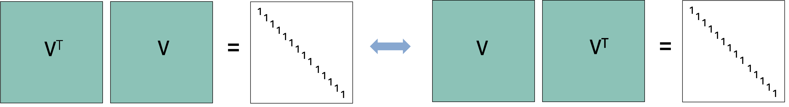
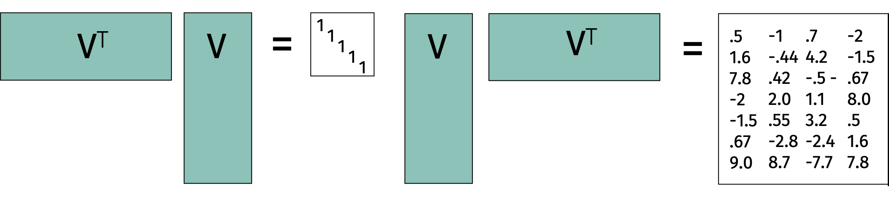
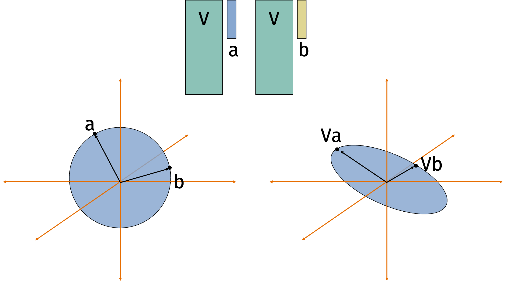
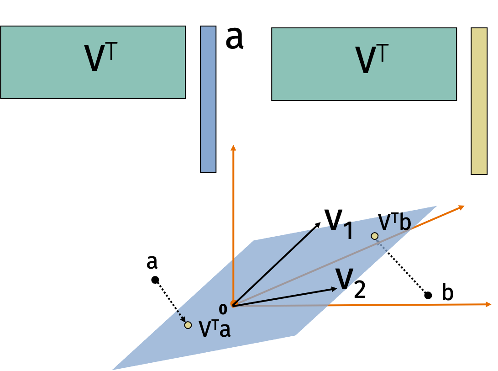
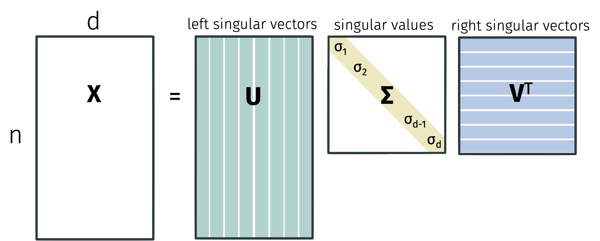
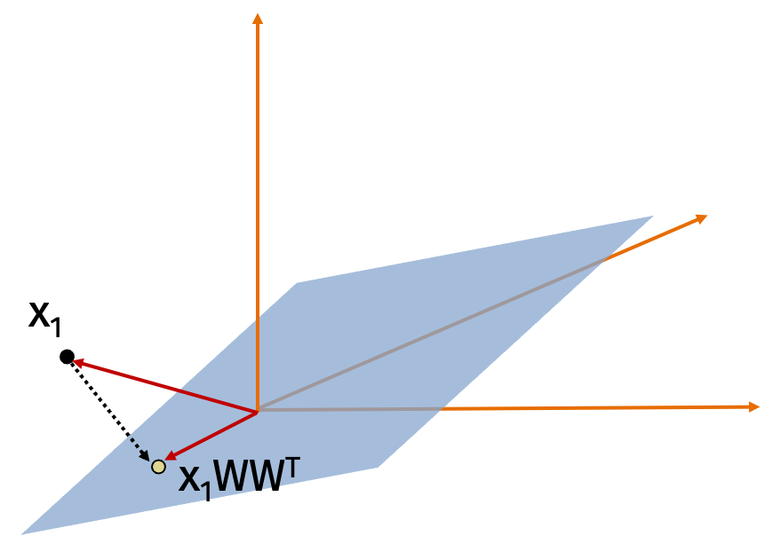
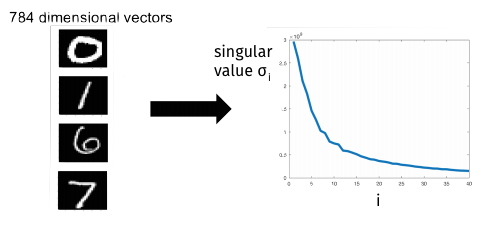
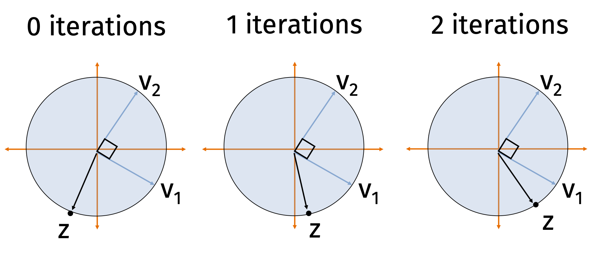

The next part of this course will cover numerical linear algebra.

## Linear Algebra Review

Recall that an eigenvalue of a square matrix $\mathbf{X} \in \mathbb{R}^{d \times d}$ is any vector $\mathbf{v}$ such that $\mathbf{Xv} = \lambda \mathbf{v}$ for some scalar $\lambda$.

The matrix $\mathbf{X}$ has at most $d$ linearly independent eigenvectors.
If it has a full set of $d$ eigenvectors $\mathbf{v}_1, \ldots, \mathbf{v}_d$ with eigenvalues $\lambda_1 \geq \ldots \geq \lambda_d$, the matrix is called diagonalizable and can be written as
$$
\mathbf{X} = \mathbf{V} \mathbf{\Lambda} \mathbf{V}^{-1}.
$$

Decomposing a matrix into its eigenvectors and eigenvalues is called eigendecomposition.

While eigendecomposition only applies to square matrices, we can extend the idea to rectangular matrices with a related tool called singular value decomposition.
But first, let's review eigendecomposition.
If a square matrix $\mathbf{V}$ has orthonormal rows, it also has orthonormal columns.

That is, $\mathbf{V}^\top \mathbf{V} = \mathbf{I}$ and $\mathbf{V} \mathbf{V}^\top = \mathbf{I}$.

This implies that, for any vector $\mathbf{x}$, $\| \mathbf{V x}\|_2^2 = \| \mathbf{x} \|_2^2 = \| \mathbf{V}^\top \mathbf{x} \|_2^2$.

To see this, we can write
\begin{align*}
\| \mathbf{V x}\|_2^2
= (\mathbf{V x})^\top (\mathbf{V x})
= \mathbf{x}^\top \mathbf{V}^\top \mathbf{V x}
= \mathbf{x}^\top \mathbf{x}
= \| \mathbf{x} \|_2^2.
\end{align*}
A similar set of steps shows that $\| \mathbf{V}^\top \mathbf{x} \|_2^2 = \| \mathbf{x} \|_2^2$.

We have the same property for the Frobenius norm of a matrix.
For any square matrix $\mathbf{X} \in \mathbb{R}^{d \times d}$, the Frobenius norm $\| \mathbf{X} \|_F^2$ is defined as the sum of squared entries $\sum_{i=1}^n \sum_{i,j} x_{ij}^2$.
To see that the same property holds for the Frobenius norm, we can write
\begin{align*}
\| \mathbf{V X}\|_F^2
= \sum_{i=1}^d \| \mathbf{V} \mathbf{X}_i \|_2^2
= \sum_{i=1}^d \| \mathbf{X}_i \|_2^2
= \| \mathbf{X} \|_F^2
\end{align*}
where $\mathbf{X}_i$ denotes the $i$th column of $\mathbf{X}$ and the second equality follows from the previous result.
A similar set of steps shows that $\| \mathbf{V}^\top \mathbf{X} \|_F^2 = \| \mathbf{X} \|_F^2$.

These properties are not true for rectangular matrices.
Let $\mathbf{V} \in \mathbb{R}^{d \times k}$ with $d > k$ be a matrix with orthogonal columns.
Then $\mathbf{V}^\top \mathbf{V} = \mathbf{I}$ but $\mathbf{V} \mathbf{V}^\top \neq \mathbf{I}$.

Similarly, for any $\mathbf{x}$, $\| \mathbf{V x}\|_2^2 = \| \mathbf{x} \|_2^2$ but $\| \mathbf{V}^\top \mathbf{x} \|_2^2 \neq \| \mathbf{x} \|_2^2$.

Multiplying a vector by a matrix $\mathbf{V}$ with orthonromal columns rotates and/or reflects the vector.

Multiplying a vector by a matrix $\mathbf{V}^\top$ with orthonormal rows projects the vector into a lower dimensional space (representing it as coordinates int he lower dimensional space).

So we always have that $\| \mathbf{V x}\|_2 \leq \| \mathbf{x} \|_2$.

## Singular Value Decomposition

Singular value decomposition is one of the most fundamental results in linear algebra.
Without loss of generality, suppose that $n \geq d$.
Any matrix $\mathbf{X} \in \mathbb{R}^{n \times d}$ can be written in the form
$$
\mathbf{X} = \mathbf{U} \mathbf{\Sigma} \mathbf{V}^\top
$$
where $\mathbf{U} \in \mathbb{R}^{n \times d}$, $\mathbf{\Sigma} \in \mathbb{R}^{d \times d}$, and $\mathbf{V} \in \mathbb{R}^{d \times d}$.
The matrix $\mathbf{U}$ satisfies $\mathbf{U}^\top \mathbf{U} = \mathbf{I}$ while $\mathbf{V}$ satisfies $\mathbf{V}^\top \mathbf{V} = \mathbf{I}$.
The matrix $\mathbf{\Sigma}$ is diagonal with non-negative entries $\sigma_1 \geq \sigma_2 \geq \ldots \geq \sigma_d \geq 0$.

Singular values are unique but factors are not.
We would still get a valid decomposition if we multiply the $i$th column of $\mathbf{U} and $\mathbf{U}$ by $-1$.

An important takeaway from singular value decomposition is how to view matrix multiplication.
We can view multiplying any vector $\mathbf{a}$ by a matrix $\mathbf{X}$ to form $\mathbf{Xa}$ as a composition of three operations:

1. Rotate and/or reflect the vector (multiplication by $\mathbf{V}^\top$).

2. Scale the coordinates (multiplication by $\mathbf{\Sigma}$).

3. Rotate and/or reflect the vector again (multiplication by $\mathbf{U}$).

We can see this because
$$
\mathbf{X a} = \mathbf{U} \left( \mathbf{\Sigma} \left( \mathbf{V}^\top \mathbf{a} \right) \right).
$$

Let's compare singular value decomposition to eigendecomposition.

* Singular value decomposition exists for all matrices (square or rectangular) while eigendecomposition only exists for some square matrices.

* Singular values are always positive while eigenvalues can be positive or negative.

* The factors $\mathbf{U}$ and $\mathbf{V}$ in singular value composition have orthogonal columns while the factor $\mathbf{V}$ in eigendecomposition has orthogonal coumns if and only if $\mathbf{X}$ is symmetric.

We can connect singular value decomposition with eigendecomposition by considering the matrix $\mathbf{X}^\top \mathbf{X}$.
The factor $\mathbf{U}$ contains the orthogonal eigenvectors of $\mathbf{X} \mathbf{X}^\top$
while the factor $\mathbf{V}$ contains the orthogonal eigenvectors of $\mathbf{X}^\top \mathbf{X}$.
To see this, recall that
$$
\mathbf{X} = \mathbf{U} \mathbf{\Sigma} \mathbf{V}^\top \text{ and }
\mathbf{X}^\top = \mathbf{V} \mathbf{\Sigma} \mathbf{U}^\top.
$$
Then
\begin{align*}
\mathbf{X}\mathbf{X}^\top
= \mathbf{U} \mathbf{\Sigma} \mathbf{V}^\top \mathbf{V} \mathbf{\Sigma} \mathbf{U}^\top
= \mathbf{U} \mathbf{\Sigma}^2 \mathbf{U}^\top
\end{align*}
and similarly
\begin{align*}
\mathbf{X}^\top \mathbf{X}
= \mathbf{V} \mathbf{\Sigma}^2 \mathbf{V}^\top.
\end{align*}
An additional observation is that the singular values of $\mathbf{X}$ are the square roots of the eigenvalues of $\mathbf{X}^\top \mathbf{X}$ and $\mathbf{X} \mathbf{X}^\top$.
That is, $\sigma_i^2 = \lambda_i(\mathbf{X X}^\top) = \lambda_i(\mathbf{X}^\top \mathbf{X})$.

There are many applications of SVD including:

* Computing the pseudoinverse $\mathbf{V} \mathbf{\Sigma}^{-1} \mathbf{U}^\top$.

* Reading off the condition number of $\mathbf{X}$ from the ratio of the largest and smallest singular values.

* Computing matrix norms like $\| \mathbf{X} \|_2 =\sigma_1$ and $\| \mathbf{X} \|_F = \sqrt{\sum_{i=1}^d \sigma_i^2}$.

* Computing the matrix square root $\mathbf{X}^{1/2} = \mathbf{V} \mathbf{\Sigma}^{1/2} \mathbf{U}^\top$.

* Performing principle component analysis.

We'll focus on a particularly useful application called low-rank approximations of $\mathbf{X}$.

## Low-Rank Approximation

The column span of a matrix $\mathbf{X} \in \mathbb{R}^{n \times d}$ is the set of all vectors that can be written as $\mathbf{Xa}$ for some $\mathbf{a} \in \mathbb{R}^d$.
The dimension of the column span $D_c$ is the maximum number of linearly independent vectors in the column span.

The row span of a matrix $\mathbf{X} \in \mathbb{R}^{n \times d}$ is the set of all vectors that can be written as $\mathbf{X}^\top \mathbf{b}$ for some $\mathbf{b} \in \mathbb{R}^n$.
The dimension of the row span $D_r$ is the maximum number of linearly independent vectors in the row span.

We have
$$
D_c \leq d \qquad D_r \leq n \qquad D_c = D_r.
$$

We call the value $D_c = D_r$ the rank of $\mathbf{X}$.

For the problem of low-rank approximation, we will approximate $\mathbf{X}$ as the product of two rank-$k$ matrices.

We will use two matrices $\mathbf{C} \in \mathbb{R}^{n \times k}$ and $\mathbf{W} \in \mathbb{R}^{d \times k}$ where $k < \min(n, d)$.
Typically, we want to choose $\mathbf{C}$ and $\mathbf{W}$ to minimize
\begin{align*}
\min_{\mathbf{B}, \mathbf{W}} \| \mathbf{X} - \mathbf{CW}^\top \|
\end{align*}
for some matrix norm.
A common choice of matrix norm is Frobenius norm.

There are several advantages of low-rank approximation including that we can store $\mathbf{CW}^\top$ is $O(nk + dk)$ space rather than $O(nd)$
and solve regression problems on $\mathbf{CW}^\top$ in $O(nk^2)$ time rather than $O(nd^2)$.

Without loss of generality, we can assume that the matrix $\mathbf{W}$ has orthonormal columns.
That is, $\mathbf{W}^\top \mathbf{W} = \mathbf{I}$.
Then we should choose $\mathbf{C}$ to minimize
$$
\min_{\mathbf{C}} \| \mathbf{X} - \mathbf{CW} \|_F^2.
$$
Notice that this is just $n$ least squares regression problems!
The $i$th least squares regression problem is given by
$$
\mathbf{c}_i = \arg \min_{\mathbf{c}} \| \mathbf{x}_i - \mathbf{W} \mathbf{c} \|_2^2.
$$
Since we have know the optimal solution to least squares regression, we can write
\begin{align*}
\mathbf{c}_i = (\mathbf{W}^\top \mathbf{W})^{-1}
\mathbf{W}^\top \mathbf{x}_i = \mathbf{W}^\top \mathbf{x}_i
\end{align*}
since $\mathbf{W}$ has orthonormal columns.
So we can write $\mathbf{C} = \mathbf{X} \mathbf{W}$
and then our optimal low-rank approximation becomes
\begin{align*}
\min_{\mathbf{W}} \| \mathbf{X} - \mathbf{X} \mathbf{W} \mathbf{W}^\top \|_F^2.
\end{align*}
The advantage of the reformulation is that we are now looking for only one matrix $\mathbf{W}$ rather than two matrices $\mathbf{C}$ *and* $\mathbf{W}$.

$\mathbf{W} \mathbf{W}^\top$ is a symmetric projection matrix.
The product $\mathbf{XW}$ gives the coordinates of the data points in the lower dimensional space.
Then $\mathbf{XW} \mathbf{W}^\top$ projects the data points back into the original space.

With this observation, can use $\mathbf{X} \mathbf{W}$ as a compressed version of the data matrix $\mathbf{X}$.
Notice that we've seen a similar approach before with the Johnson-Lindenstrauss lemma where we used a random projection matrix $\mathbf{R}$ to get $\mathbf{XR}$ as a compressed version of the data matrix $\mathbf{X}$.
If we choose $\mathbf{W}$ well and $\mathbf{X} \approx \mathbf{XW} \mathbf{W}^\top$, we expect that
$$
\| \mathbf{x}_i - \mathbf{x}_j \|_2^2
\approx \| \mathbf{x}_i \mathbf{WW}^\top - \mathbf{x}_j \mathbf{WW}^\top \|_2^2
= \| \mathbf{x}_i \mathbf{W} - \mathbf{x}_j \mathbf{W} \|_2^2
$$
where the last equality follows from the fact that $\mathbf{W}^\top \mathbf{W} = \mathbf{I}$.

While low-rank approximation and Johnson-Lindenstrauss projection are similar, there are some important differences:

* Low-rank approximation is deterministic while Johnson-Lindenstrauss projection is randomized.

* Low-rank approximation seeks to minimize the reconstruction error while Johnson-Lindenstrauss projection seeks to preserve pairwise distances with high probability.

## Best Low-Rank Approximation
Low-rank approximations are very useful when our data has some structure.
For example, if a dataset only has $k$ unique data points, it will be exactly rank $k$.
If it has $k$ "clusters" of data points (e.g. the 10 digits in the MNIST dataset), the matrix will often be very close to rank $k$.
Similarly, correlation between columns (data features) leads to a low-rank matrix.

We can exploit low-rank structure by using low-rank approximations to reduce the dimensionality of the data or visualizing the data in a lower dimensional space.
Examples include data embeddings like word2vec or node2vec, reduced order modeling for solving physical equations, constructing preconditioners in optimization, and noisy triangulation.

Because low-rank approximations are so useful, we would like to know how to find the best low-rank approximation to a matrix $\mathbf{X}$.
In fact,
we will show that we can find the best rank-$k$ approximation to $\mathbf{X}$ by computing the singular value decomposition of $\mathbf{X}$ and then setting all but the $k$ largest singular values to zero.

Let $\mathbf{X} = \mathbf{U} \mathbf{\Sigma} \mathbf{V}^\top$ be the singular value decomposition of $\mathbf{X}$.
Let $\mathbf{X}_k$ be the best rank-$k$ approximation to $\mathbf{X}$ i.e.
$$
\mathbf{X}_k = \arg \min_{\text{rank } k \text{ } \mathbf{B}} \| \mathbf{X} - \mathbf{B} \|_F^2.
$$
We will show that $\mathbf{X}_k = \mathbf{U}_k \mathbf{\Sigma}_k \mathbf{V}_k^\top$ where $\mathbf{U}_k$ contains the first $k$ columns of $\mathbf{U}$, $\mathbf{\Sigma}_k$ contains the first $k$ singular values of $\mathbf{\Sigma}$ and $\mathbf{V}_k$ contains the first $k$ columns of $\mathbf{V}$.

We will repeatedly use two observations:

* $\| \mathbf{V} \mathbf{X} \|_F^2 = \| \mathbf{X} \|_F^2$ if $\mathbf{V}^\top \mathbf{V} = \mathbf{I}$ by the connection to $\ell_2$ norm we saw before
and

* $\| \mathbf{X}^\top \|_F^2 = \| \mathbf{X} \|_F^2$ since the Frobenius norm is the sum of squared entries (which is invariant under the transpose operation).

We can write
\begin{align*}
\arg \min_{\text{rank } k \text{ } \mathbf{B}}
\| \mathbf{X} - \mathbf{B} \|_F^2
= \arg \min_{\text{rank } k \text{ } \mathbf{B}}
\| \mathbf{\Sigma V}^\top - \mathbf{U}^\top \mathbf{B} \|_F^2 
\end{align*}
since $\mathbf{U}^\top \mathbf{U} = \mathbf{I}$.

Then
\begin{align*}
\arg & \min_{\text{rank } k \text{ } \mathbf{B}}
\| \mathbf{\Sigma V}^\top - \mathbf{U}^\top \mathbf{B} \|_F^2 \\
&= \arg \min_{\text{rank } k \text{ } \mathbf{B}}
\| \mathbf{V \Sigma } - \mathbf{B}^\top \mathbf{U} \|_F^2 \\
&= \arg \min_{\text{rank } k \text{ } \mathbf{B}}
\| \mathbf{\Sigma} - \mathbf{V}^\top \mathbf{B}^\top \mathbf{U} \|_F^2
\end{align*}
since $\mathbf{V}^\top \mathbf{V} = \mathbf{I}$.

Then we choose $\mathbf{B}$ so that $\mathbf{V}^\top \mathbf{B}^\top \mathbf{U}$ As the matrix which agrees with $\mathbf{\Sigma}$ on the largest $k$ singular values.
It is intuitive but not obvious that the best rank-$k$ approximation to a diagonal matrix is a diagonal matrix that agrees on the largest $k$ values.

**Claim (Orthogonal Projection):**
Consider any orthogonal matrix $\mathbf{W} \in \mathbb{R}^{d \times k}$.
Then
$$
\| \mathbf{X} - \mathbf{X W W}^\top \|_F^2
= \| \mathbf{X} \|_F^2 - \| \mathbf{X W W}^\top \|_F^2.
$$

We will prove the orthogonal claim later.
Using the claim,
observe that the problem of finding the best rank $k$ approximation $\mathbf{Z}$ to a diagonal matrix $D$ is equivalent to
\begin{align*}
&\arg \min_{\text{rank $k$ } \mathbf{Z}}
\| \mathbf{D} - \mathbf{Z} \|_F^2 \\
&= \arg \min_{\text{orthonormal rank $k$ } \mathbf{Z}}
\| \mathbf{D}  - \mathbf{D Z Z}^\top \|_F^2 \\
&= \arg \min_{\text{orthonormal rank $k$ } \mathbf{Z}}
\| \mathbf{D} \|_F^2 - \| \mathbf{D Z Z}^\top \|_F^2 \\
&= \arg \max_{\text{orthonormal rank $k$ } \mathbf{Z}}
\| \mathbf{Z}^\top \mathbf{D} \|_F^2 \\
&= \arg \max_{\text{orthonormal rank $k$ } \mathbf{Z}} \sum_{i=1}^d \| \mathbf{Z}_i \|_2^2 \sigma_i^2
\end{align*}
where the second equality follows from the orthogonal projection claim, the third equality followes because $\| \mathbf{D} \|_F^2$ is a constant with respect to $\mathbf{Z}$, and $\mathbf{Z}_i$ is the $i$th row of $\mathbf{Z}$ in the final expression.
Since $\mathbf{Z}$ is orthonormal and rank $k$, we have
$$\sum_{i=1}^d \| \mathbf{Z}_i \|_2^2 = k.$$
To see this, observe that sum of squared row norms is the sum of squared column norms which is $k$.
Since $\mathbf{Z}$ has $k$ orthnormal orthonormal columns and $d < k$, we have
$$
\| \mathbf{Z}_i \|_2^2 \leq 1.
$$
To see this, imagine "completing" $\mathbf{Z}$ by adding columns to make its rows span the entire space.
After adding the columns, each row would be a unit vector so each row of $\mathbf{Z}$ can have norm at most $1$.
With these observations,
$$
\max_{\text{orthonormal rank $k$ } \mathbf{Z}} \sum_{i=1}^d \| \mathbf{Z}_i \|_2^2 \sigma_i^2
= \sum_{i=1}^d \sigma_i^2
$$
since we want to put as much mass on the larger singular values as possible.

Now that we know the SVD of a diagonal matrix is the best rank-$k$ approximation, we will return to the orthogonal projection claim.
One useful observation of the claim is that
$$
\arg \min_{\mathbf{W} \in \mathbb{R}^{d \times k}}
\| \mathbf{X} - \mathbf{X W W}^\top \|_F^2
= \arg \max_{\mathbf{W} \in \mathbb{R}^{d \times k}} \| \mathbf{X W W}^\top \|_F^2.
$$
Since $\| \mathbf{X} \|_F^2$ is a constant with respect to $\mathbf{W}$, we can maximize $\| \mathbf{X W W}^\top \|_F^2$ to minimize $\| \mathbf{X} - \mathbf{X W W}^\top \|_F^2$.
This is often the perspective people take when thinking about principle component analysis.

We will show the orthogonal claim from the observation that the column $\mathbf{X}_i$ is orthogonal to itself projected onto $\mathbf{W W}^\top$ and then applying the Pythagorean theorem.

The orthogonal projection claim combined with our characterization of the optimal low rank approximation gives us
$$
\| \mathbf{X} - \mathbf{X}_k \|_F^2
= \| \mathbf{X} \|_F^2 - \| \mathbf{X}_k \|_F^2
= \sum_{i=1}^n \sigma_i^2 - \sum_{i=1}^k \sigma_i^2
= \sum_{i=1}^k \sigma_i^2.
$$

We can see this because
\begin{align*}
\| \mathbf{X} \|_F^2
= \| \mathbf{U} \mathbf{\Sigma} \mathbf{V}^\top \|_F^2
= \| \mathbf{\Sigma} \mathbf{V}^\top \|_F^2
= \| \mathbf{\Sigma} \|_F^2
\end{align*}
where we used our favorite tricks that $\mathbf{U}^\top \mathbf{U} = \mathbf{I}$, $\mathbf{V}^\top \mathbf{V} = \mathbf{I}$, and the Frobenius norm is invariant with respect to transposes.

The characterization of our low-rank approximation error in terms of the singular values gives a sense of *how* low-rank a matrix is.
Data with structure will have a small number of large singular values and a large number of small singular values.

In contrast, data with no structure will have singular values that are all roughly the same size.

Now that we know the best low-rank approximation is the truncated SVD, all that remains is to find the  SVD.

We can find the SVD with the following approach:

* Compute $\mathbf{X}^\top \mathbf{X}$ in $O(nd^2)$ time.

* Find eigendecomposition of $\mathbf{X}^\top \mathbf{X} = \mathbf{V} \mathbf{\Lambda} \mathbf{V}^\top$ in $O(d^3)$ time using methods like the QR algorithm in $O(d^3)$ time.

* Finally, compute $\mathbf{L} = \mathbf{X V}$ and then set $\sigma_i = \| \mathbf{L}_i \|_2$ and $\mathbf{U}_i = \mathbf{L}_i / \sigma_i$ for $i = 1, \ldots, d$ in $O(n d^2)$ time.

The total time complexity is $O(nd^2 + d^3 + nd^2) = O(nd^2)$.
If we use the SVD only for low rank approximation, notice that we didn't really need to find all the singular vectors and values.

We can go faster by computing an approximate solution to the SVD.
In particular, we will only compute the top $k$ singular vectors and values.
We can do this with iterative algorithms that achieve time complexity $O(ndk)$ instead of $O(nd^2)$.
There are many algorithms for this problem:

* **Krylov subspace methods** like the Lanczos method are most commonly used in practice.

* **Power method** is the simplest Krylov subspace method and still works very well.

## Power Method

The power method computes the top right singular vector, $\mathbf{v}_1$, of a matrix $\mathbf{X} \in \mathbb{R}^{n\times d}$ with  singular value decomposition $\mathbf{X} = \mathbf{U\Sigma V}^\top$. The method is as follows:

**Power Method:**

* Choose $\mathbf{z}^{(0)}$ randomly. E.g. $\mathbf{z}^{(0)} \sim \mathcal{N}(0,1)$.
* $\mathbf{z}^{(0)} = \mathbf{z}^{(0)} /\|\mathbf{z}^{(0)}\|_2$
* For $i = 1,\ldots, q$
  * $\mathbf{z}^{(i)} = \mathbf{X}^\top \mathbf{X} \mathbf{z}^{(i-1)} )$
  * $n_i = \|\mathbf{z}^{(i)}\|_2$
  * $\mathbf{z}^{(i)}  = \mathbf{z}^{(i)}/n_i$
* Return $\mathbf{z}^{(q)}$

In other words,  each of our iterates $\mathbf{z}^{(i)}$ is simply a scaling of  a column in the following matrix:
$$
K = \begin{bmatrix} \mathbf{z}^{(0)} & \mathbf{A}\mathbf{z}^{(0)} & \mathbf{A}^2 \mathbf{z}^{(0)} & \mathbf{A}^3\mathbf{z}^{(0)} \ldots \mathbf{A}^q \mathbf{z}^{(0)}\end{bmatrix},
$$
where $\mathbf{A} = \mathbf{X}^\top\mathbf{X}$. Typically we run $q \ll d$ iterations, so $K$ is a tall, narrow matrix. The span of $K$'s columns is called a **Krylov subspace** because it is generated by starting with a single vector $\mathbf{z}^{(0)}$ and repeatedly multiplying by a fixed matrix $A$. We will return to $K$ shortly. 

#### Analysis Preliminaries 

Let $\mathbf{v}_1, \ldots, \mathbf{v}_d$ be the right singular vectors of $\mathbf{X}$ (the columns of $\mathbf{V}$). We write each iterate in terms of this basis of vectors:
$$
\begin{align*}
\mathbf{z}^{(0)} &= c_1^{(0)}\mathbf{v}_1 + {c}_2^{(0)}\mathbf{v}_2 + \ldots + c_d^{(0)} \mathbf{v}_d \\
		\mathbf{z}^{(1)} &= c_1^{(1)}\mathbf{v}_1 + {c}_2^{(1)}\mathbf{v}_2 + \ldots + c_d^{(1)} \mathbf{v}_d\\
		&\vdots\\
		\mathbf{z}^{(q)} &= c_1^{(q)}\mathbf{v}_1 + {c}_2^{(i)}\mathbf{v}_2 + \ldots + c_d^{(q)} \mathbf{v}_d
\end{align*}
$$

Note that $c_j^{(i)} = \langle \mathbf{z}^{(i)}, v_i\rangle$. Intuitively, we expect the relative size of $c_1^{(i)}$ to **increase**  in comparison to the other coefficients as $i$ increases, which is good because then  $\mathbf{z}^{(q)}$ will start looking more and more like $\mathbf{v}_1$. Why do we expect this? Because $\mathbf{z}^{(i)} = \frac{1}{n_i}\mathbf{A}^q \mathbf{z}^{(i-1)}$ and thus we can check that $c_j^{(i)} = \frac{1}{n_i}\sigma_j^2 c^{(i-1)}_j$. The $\frac{1}{n_i}$ term is fixed for all $j$, but the $\sigma_j^2$ term will be largest for $j=1$, and thus the $c_1^{(i)}$ will increase in size more than any other term. We will analyze this formally soon.

First however, let's see what it suffices to prove.

**Claim 1**: If $c_j^{(q)}/c_1^{(q)} \leq \sqrt{\epsilon/d}$ for all $j\neq 1$ than either $\|\mathbf{v}_1 -\mathbf{z}^{(q)}\|_2^2\leq 2\epsilon$ or $\|-\mathbf{v}_1 - \mathbf{z}^{(q)}\|_2^2\leq 2\epsilon$ . 

*Proof.* Since $c_1^{(q)} \leq 1$, the above would imply that $c_j^{(q)} \leq \sqrt{\epsilon/d}$.  Since $\sum_{k=1}^d \left(c_k^{(q)}\right)^2 = 1$ it follows that $\left(c_1^{(q)}\right)^2 \geq (1-\epsilon)$ and thus $\left|c_1^{(q)}\right| \geq 1-\epsilon$. Then for any unit vector $\mathbf{x}$ we have $\|\mathbf{x} -\mathbf{z}^{(q)}\|_2 = 2 - 2\langle\mathbf{x},\mathbf{z}^{(q)}\rangle$. Since  $\langle\mathbf{v}_1,\mathbf{z}^{(q)}\rangle = c_1^{(q)}$ we conclude that either $\langle\mathbf{v}_1,\mathbf{z}^{(q)}\rangle \geq 1-\epsilon$ or  $\langle- \mathbf{v}_1,\mathbf{z}^{(q)}\rangle \geq 1-\epsilon$. Suppose without loss of generality it's the first: $\langle\mathbf{v}_1,\mathbf{z}^{(q)}\rangle \geq 1-\epsilon$. Then  we would conclude that $\|\mathbf{v}_1 -\mathbf{z}^{(q)}\|_2 = 2 - 2\langle\mathbf{v}_1,\mathbf{z}^{(q)}\rangle \leq 2 - 2\cdot (1-\epsilon) = 2\epsilon$. $\square$ 

So, to show power methods converges, our goal is to prove that $\left|c_j^{(q)}/c_1^{(q)}\right| \leq \sqrt{\epsilon/d}$ for all $j\neq 1$. 

#### Heart of the Analysis 

To prove this bound, we note that $c_j^{(q)} = S\cdot \sigma_j^{2q} c_j^{(0)}$ for any $j$ and $c_1^{(q)} = S\cdot \sigma_1^{2q} c_1^{(0)}$ where $S = 1/\prod_{i=1}^q n_i$ is some fixed scaling. So:
$$
\left|\frac{c_j^{(q)} }{c_1^{(q)} }\right| = (\sigma_j/\sigma_1)^{2q} \left|\frac{c_j^{(0)} }{c_1^{(0)} }\right|.
$$
As claimed in class (and can be prove as an exercise -- try using rotational invariance of the Gaussian ) if $z^{(0)}$ is a randomly initialized start vector,   $\left|\frac{c_j^{(0)} }{c_1^{(0)} }\right| \leq d^{3}$ with high proability. That may seem like a lot, but $(\sigma_j/\sigma_1)^{2q}$ is going to be a tiny number, so will easily cancel that out. In particular, 
$$
(\sigma_j/\sigma_1)^{2q} = \left(1-\frac{\sigma_1-\sigma_j}{\sigma_1}\right)^{2q} \leq (1-\gamma)^{2q},
$$
where $\gamma = \frac{\sigma_1-\sigma_2}{\sigma_1}$ is our spectral gap parameter. As long as we set 
$$
q = \frac{\log(d^3\sqrt{d/\epsilon})}{\gamma} = O\left(\frac{\log(d/\epsilon)}{\gamma}\right),
$$
then $(1-\gamma)^{2q} \leq \frac{\sqrt{\epsilon/d}}{d^3}$, and thus 
$$
\left|\frac{c_j^{(q)} }{c_1^{(q)} }\right| = (\sigma_j/\sigma_1)^{2q} \left|\frac{c_j^{(0)} }{c_1^{(0)} }\right| \leq d^3\cdot \frac{\sqrt{\epsilon/d}}{d^3} \leq \sqrt{\epsilon/d},
$$
as desired.

#### Alternative Guarantee

In machine learning applications, we care less about actually approximating $\mathbf{v}_1$, and more that the $\mathbf{z}$ is a "good top singular vector" in that it offers a good rank-1 approximation to $\mathbf{X}$. Tha tis, we want to prove that $$\|\mathbf{X} - \mathbf{X}\mathbf{z}\mathbf{z}^\top\|_F^2 = \|\mathbf{X}\|_F^2 - \|\mathbf{X}\mathbf{z}\mathbf{z}^\top\|_F^2$$ is small, or equivalently, that $$\|\mathbf{X}\mathbf{z}\mathbf{z}^\top\|_F^2$$ is large. The largest it could be is $\|\mathbf{X}\mathbf{v}_1\mathbf{v}_1^\top\|_F^2 = \sigma_1^2$. And from the same argument above, where we claimed that  either $\langle\mathbf{v}_1,\mathbf{z}^{(q)}\rangle \geq 1-\epsilon$ or  $\langle- \mathbf{v}_1,\mathbf{z}^{(q)}\rangle \geq 1-\epsilon$, it is not hard to check that $$\|\mathbf{X}\mathbf{z}\mathbf{z}^\top\|_F^2 \geq (1-\epsilon)^2 \sigma_1^2$$, so after 
$O\left(\frac{\log(d/\epsilon)}{\gamma}\right)$ we get a near optimal low-rank approximation. 

## The Lanczos Method	

We will now see how to improve on power method using what is known as the Lanczos method. Like power method, Lanczos is considered a **Krylov subspace method** because it will return a solution **in the span of the Krylov subspace** that we introduced before. Power method clearly does this -- it returns a scaling of the last column of $K$. The whole idea behind Lanczos is to avoid "throwing away'" information from earlier columns like power method, but instead to take advantage of the whole space. It turns at that doing so can be very helpful -- we will get a bound that depends on $1/\sqrt{\gamma}$ instead of $1/\gamma$. 

Specifically, to definte the Lanczos method, we will let $\mathbf{Q}\in \mathbb{R}^{d\times k}$ be a matrix with orthonormal columns that spans $K$. In practice, you need to be careful about how this is computed for numerical stability reasons, but we won't worry about that for now. Imagine your computer has infinite precision and we just compute $\mathbf{Q}$ by orthonormalizing $K$. 

**Lanczos Method**

* Compute an orthonormal span $\mathbf{Q}$ for the degree $q$ Krylov subspace. 
* Let $\mathbf{z}$ be the top eigenvector of $\mathbf{Q}^\top \mathbf{A}\mathbf{Q} = \mathbf{Q}^\top \mathbf{X}^\top \mathbf{X} \mathbf{Q}$ 
* Return $\mathbf{Q} \mathbf{z}$. 

Importantly, the first step only requires $q$ matrix-vector multiplications with $\mathbf{X}^\top\mathbf{X}$, each of which can be implemented in $O(nd)$ time, just like we did for power method. The second step might look a bit circular at first glance. We want an approximation algorithm for computing the top eigenvector of ${\mathbf{X}}^\top\mathbf{X}$ and the above method uses a top eigenvector algorithm as a subroutine. But note that $\mathbf{Q}^\topA{\mathbf{Q}}$ only has size $q\times q$, where $q\ll d$ is our iteration count. So even if it's too expensive to compute a direct eigendecomposition of $\mathbf{X}^\top\mathbf{X}$, ${\mathbf{Q}}^\top{\mathbf{X}}^\top{\mathbf{X}}{\mathbf{Q}}$ can be computed in $O(ndq) + O(dq^2) + O(q^3) + O(ndq)$ time (the first part is the time to construct $\mathbf{Q}$ and $\mathbf{X}\mathbf{Q}$, the second to compute ${\mathbf{Q}}^\top{\mathbf{X}}^\top{\mathbf{X}}{\mathbf{Q}}$, and the third to find its top eigenvector using a direct method).

#### Analysis Preliminaries 

Our first claim is that Lanczos returns the *best* approximate singular vector in the span of the Krylov subspace. Then we will argue that there always exists *some* vector in the span of the subspace that is significantly better than what power method returns, so the Lanczos solution must be significantly better as well.  

**Claim 2**: Amongst all vectors in the span of the Krylov subspace (i.e., any vector $\mathbf{y}$ that can be written as $\mathbf{y} = \mathbf{Q}\mathbf{x}$ for some $x\in \mathbb{R}^k$), $\mathbf{y}^* = \mathbf{Q}\mathbf{z}$ minimizes the low-rank approximation error $\|\mathbf{X} - \mathbf{X}\mathbf{y}\mathbf{y}^\top\|_F^2$. 

*Proof.* First, we can prove that $\mathbf{y}$ should always be chosen to have unit norm, so that $\mathbf{y}\mathbf{y}^\top$ is a projection. Accordingly, it must also be that $\mathbf{x} = \mathbf{Q}^\top\mathbf{y}$ has unit norm. Then, proving the claim above is equivalent to proving that $\mathbf{y}^* = {\mathbf{Q}}\mathbf{z}$ maximizes $\|\mathbf{X}\mathbf{y}\mathbf{y}^\top\|_F^2 = \|\mathbf{X}\mathbf{y}\|_F^2 = \|\mathbf{X}\mathbf{y}\|_2^2 = \|\mathbf{X}\mathbf{Q}\mathbf{x}\|_2^2$. It is not hard to check that setting $\mathbf{x}$ to be the maximum right singular vector of ${\mathbf{X}}{\mathbf{Q}}$ maximizes this $\|\mathbf{X}\mathbf{Q}\mathbf{x}\|_2^2$ amongst all unit vectors, and this right singular vector is the same at the top eigenvector of $\mathbf{Q}^\top \mathbf{X}^\top \mathbf{X} \mathbf{Q}$. 

**Claim 3**: If we run the Lanczos method for $O\left(\frac{\log(d/\epsilon)}{\sqrt{\gamma}}\right)$ There is *some* vector $\mathbf{w}$ of the form $\mathbf{w} = \mathbf{Q}\mathbf{x}$ such that either either $\langle\mathbf{v}_1,\mathbf{w}\rangle \geq 1-\epsilon$ or  $\langle- \mathbf{v}_1,\mathbf{w}\rangle \geq 1-\epsilon$. 

In other words, there is some $\mathbf{w}$ in the Krylov subspace that has a large inner product with the true top singular vector $\mathbf{v}_1$. As seen earlier for power method, this can be used to prove that e.g. $\|\mathbf{X}\mathbf{w}\mathbf{w}^\top\|_F^2$ is large, and from **Claim 2**, we know that the $\mathbf{v}$ returned by Lanczos can only do better. So, we focus on proving **Claim 3**. 

#### Heart of the Analysis 

The key idea is to observe that any vector in the span of the Krylov subspace of size $q$ -- i.e. any vector $\mathbf{w}$ that can be written $\mathbf{w} = \mathbf{Q}\mathbf{x}$  is equal to:
$$
\mathbf{w} = p(\mathbf{A})\mathbf{z}^{(0)},
$$
for some **degree q polynomial** $p$. For example, we might have $p(A) = 2\mathbf{\mathbf{A}}^2 - 4\mathbf{A}^3 + \mathbf{A}^6$ or $p(\mathbf{A}) = I - \mathbf{A} - 10\mathbf{A}^5$. And moreover, for any degree $q$ polynomial $p$, there is *some* $\mathbf{x}$ such that  $\mathbf{Q}\mathbf{x} = p(\mathbf{A})\mathbf{z}^{(0)}$. To see that this is true, we note that all of the monomials $\mathbf{z}^{(0)}, A\mathbf{z}^{(0)}, \ldots, \mathbf{A}^q\mathbf{z}^{(0)}$ lie in the span of $\mathbf{Q}$, so any linear combination does as well. 

This means that showing there is a good approximate top singular vector $\mathbf{w}$ in the span of the Krylov subspace can be reduced to finding a **good polynomial $p(\mathbf{A})$**. Specifically, notice that, if we write $p(\mathbf{A})\mathbf{z}^{(0)}$ in the span of the singular vectors we have:
$$
p(\mathbf{A})\mathbf{z}^{(0)} = g_1 \mathbf{v}_1 + g_2 \mathbf{v}_2 + \ldots + g_d \mathbf{v}_d
$$
where
$$
g_j = c_j^{(0)}p(\sigma_j^2).
$$
Our goal, which is exactly the same as when we analyzed power method, is to show that $g_1$ is *much larger* than $g_j$ for all $j \neq 1$.  In other words we want to find a polynomial such that $p(t)$ is small for all values of  $0\leq t< \sigma_1^2$, but then the polynomial should suddenly **jump** to be large at $$\sigma_1$$. The simplest degree $q$ polynomial that does this is $p(t) = t^q$. However, it turns out there are more *sharply* jumping polynomials, which can be obtained by shifting/scaling a type of polynomials known as a [Chebyshev polynomial](https://en.wikipedia.org/wiki/Chebyshev_polynomials). An example that jumps at $\sigma_1^2 = 1$ is shown below. The difference from $t^q$ is pretty remarkable -- even though the polynomial $p$ shown below is nearly as small for all $0\leq t< 1$, it is much larger at $t=1$. 

Concretely we can claim the following, which is a bit tricky to prove, but well known (see [Lemma 5 here](https://arxiv.org/pdf/1504.05477.pdf) for a full proof).

**Claim 4:** There is a degree $O\left(\sqrt{\frac{1}{\gamma}}\log\frac{1}{\epsilon}\right)$ degree polynomial $\hat{p}$ such that $\hat{p}(1) = 1$ and  $|p(t)| \leq \epsilon$ for $0 \leq t \leq 1-\gamma$. 

In contrast, to ensure that $t^q$ satisfies the above, we would need degree q = $O\left({\frac{1}{\gamma}\log\frac{1}{\epsilon}}\right)$ -- a quadratically worse bound. This is what will account for the quadratic difference in performance between the Lanczos and Power Methods. 

The fact that there exist much steeper low-degree polynomails than $t^q$ is the sort of thing studied in the mathematical field known as Approximation Theory. That might see pretty obscure, but steep polynomials are surprisingly useful in computer science, appearing everywhere from [classic](https://dl.acm.org/doi/10.1145/129712.129757), to [Quantum complexity theory](https://arxiv.org/pdf/quant-ph/9802049.pdf), to [learning theory](http://www.cs.columbia.edu/~rocco/Public/stoc01.pdf). If you're interested in learning more about this, check out slides for this [talk](http://people.cs.georgetown.edu/jthaler/QuICSslides.pdf).

#### Finishing Up

Finally, we use **Claim 4** to finish the analysis of Lanczos. Consider the vector $\hat{p}\left(\frac{1}{\sigma_1^2}A\right)\mathbf{z}^{(0)}$, which as argued above lies in the Krylov subspace. As discussed below equation (7), our job is to prove that:
$$
\frac{c_j^{(0)}\hat{p}\left(\frac{1}{\sigma_1^2}\sigma_j^2\right)}{c_1^{(0)}\hat{p}\left(\frac{1}{\sigma_1^2}\sigma_1^2\right)} \leq \sqrt{\epsilon/d},
$$
for all $j \neq i$, as long as $\hat{p}$ is chosen to have degree $q = O\left(\sqrt{\frac{1}{\gamma}}\log\frac{d}{\epsilon}\right)$ 

Consider the numerator first. $\frac{\sigma_j^2}{\sigma_1^2} = \left(\frac{\sigma_j}{\sigma_1}\right)^2 = \left(1 - \left(1-\frac{\sigma_j}{\sigma_1}\right)\right)^2 = \left(1 - \frac{\sigma_1 - \sigma_j}{\sigma_1}\right)^2 \leq (1-\gamma)^2 \leq (1-\gamma)$ .

Accordingly, if we set $q = O\left(\sqrt{\frac{1}{\gamma}}\log\frac{1}{\epsilon'}\right)$  where $\epsilon' = \sqrt{\epsilon/d}/d^3$,  then $\hat{p}\left(\frac{1}{\sigma_1^2}\sigma_j^2\right) \leq \epsilon'$. And the denomenator is simply equal to $c_1^{(0)}\hat{p}(1) =  c_1^{(0)}\cdot 1$. So, since $c_j^{(0)}/c_1^{(0)}\leq d^3$ with high probability, as argued earlier, (9) holds. And thus **Claim 3** is proven by setting $\mathbf{w} = \hat{p}\left(\frac{1}{\sigma_1^2} \mathbf{A} \right)\mathbf{z}^{(0)}$.

<!--
### Power Method

We'll focus on the power method since it is the simplest to understand.
For exposition, we'll assume that $k=1$.
Our goal is to find a vector $\mathbf{z} \approx \mathbf{v}_1$ where $\mathbf{v}_1$ is the top singular vector of $\mathbf{X}$.

We start with a randomly initialized vector
$$
\mathbf{z}^{(0)} \sim \mathcal{N}(0, \mathbf{I}).
$$
We will see why it is important that $\mathbf{z}^{(0)}$ is rotationally invariant later.
We will then normalize $\mathbf{z}^{(0)}$ to have unit length so $\mathbf{z}^{(0)} = \mathbf{z}^{(0)} / \| \mathbf{z}^{(0)} \|_2$.
For each iteration $t = 1, \ldots, T$, we will compute
$$
\mathbf{z}^{(i)} = \mathbf{X}^\top \mathbf{X} \mathbf{z}^{(i-1)} \qquad n_t = \| \mathbf{z}^{(i)} \|_2.
$$
and then re-normalize so $\mathbf{z}^{(i)} = \mathbf{z}^{(i)} / n_t$.
Finally, we return $\mathbf{z}^{(T)}$.

The method is called the power method because each iterate looks a matrix raised to a power
$$
\mathbf{z}^{(t)} = (\mathbf{X}^\top \mathbf{X})^\top \mathbf{z}^{(0)}.
$$
The run time of the algorithm is $T O(nd)$ if we use matrix-vector multiplications to compute $\mathbf{X}^\top(\mathbf{X} \mathbf{z}^{(i-1)})$.

As the algorithm runs, the vector $\mathbf{z}^{(t)}$ converges to the top singular vector $\mathbf{v}_1$.

We will prove the following convergence theorem.

**Basic Power Method Convergence:**
Let $\gamma = \frac{\sigma_1 - \sigma_2}{\sigma_1}$ be a parameter capture the *gap* between the first and second largest singular values. If power method is initialized with a random Gaussian vector then, with high probability after $T = O \left( \frac{\log d/\epsilon}{\gamma} \right)$ iterations, we have either
$$
\| \mathbf{v}_1 - \mathbf{z}^{(T)} \|_2 \leq \epsilon
\qquad \text{or} \qquad
\| \mathbf{v}_1 + \mathbf{z}^{(T)} \|_2 \leq \epsilon.
$$

We have the two possible guarantees because we will recover $\mathbf{v}_1$ or $-\mathbf{v}_1$ depending on the sign of the first entry of $\mathbf{v}_1$.

The total time complexity is $O \left( nd \frac{\log d/\epsilon}{\gamma} \right)$.

We can verify that we have found a good approximation to $\mathbf{v}_1$ by checking whether $\mathbf{X}^\top \mathbf{X} \mathbf{z}^{(T)}$ is close to $\sigma \mathbf{z}^{(T)}$ for some scalar $\sigma$.
Notice that this is equivalent to checking the distance between two iterates.

We will prove the theorem by writing each iterate $\mathbf{z}^{(t)}$ in terms of the singular vectors $\mathbf{v}_1, \ldots \mathbf{v}_d$.

We can write
\begin{align*}
\mathbf{z}^{(t)}
= c_1^{(t)} \mathbf{v}_1 + \ldots + c_d^{(t)} \mathbf{v}_d
\end{align*}
where $[c_1^{(t)}, \ldots, c_d^{(t)}] = \mathbf{c}^{(t)} = \mathbf{V}^\top \mathbf{z}^{(t)}$ .
Since $\mathbf{V}$ is orthogonal, notice that
$\| \mathbf{z}^{(t)} \|_2 = 1$ implies that
$\| \mathbf{c}^{(t)} \|_2 = 1$.

We will focus on a single iteration $t$ and a single component $j$ of the iterate
We have that
$$
c_j^{(t)} = \sigma_j^2 c_j^{(t-1)} \frac1{n_t}
$$

Notice that $\mathbf{X}^\top \mathbf{X} = \mathbf{V} \mathbf{\Sigma} \mathbf{U}^\top \mathbf{U} \mathbf{\Sigma} \mathbf{V}^\top = \mathbf{V} \mathbf{\Sigma}^2 \mathbf{V}^\top$.

So then 
\begin{align*}
\mathbf{z}^{(t)}
= \frac1{n_t}
\mathbf{X}^\top \mathbf{X} \mathbf{z}^{(t-1)}
= \frac1{n_t}
\mathbf{V} \mathbf{\Sigma}^2 \mathbf{V}^\top \mathbf{z}^{(t-1)}
= \frac1{n_t} \mathbf{V} \mathbf{\Sigma}^2 \mathbf{c}^{(t-1)}.
\end{align*}

This operation composes after $T$ updates.
So we can write
\begin{align*}
\mathbf{z}^{(T)}
= \frac1{\prod_{t=1}^\top n_t} 
\left[ c_1^{(1)} \sigma_1^{2T}
\mathbf{v}_1 + c_2^{(1)} \sigma_2^{2T}
\mathbf{v}_2 + \ldots + c_d^{(1)} \sigma_d^{2T} \mathbf{v}_d
\right].
\end{align*}

Let $\alpha_j = \frac1{\prod_{t=1}^\top n_t} c_j^{(0)} \sigma_j^{2T}$.
We want to show that $\alpha_j \ll \epsilon$ for $j \neq 1$.

Since $\mathbf{z}^{(T)} is a unit vector,
$\sum_{i=1}^d \alpha_i^2 = 1$ so $|\alpha_1| \leq 1.
If we can prove that
$|\frac{\alpha_j}{\alpha_1}| \leq \sqrt{\frac{\epsilon}{2d}}$ then we will have that
$\| \mathbf{v}_1 - \mathbf{z}^{(T)} \|_2^2 \leq \epsilon$
since
\begin{align*}
\alpha_j^2 &\leq \alpha_1^2 \frac{\epsilon}{2d} \\
1 = \alpha_1^2 + \sum_{j=2}^d \alpha_d^2 &\leq \alpha_1^2 + \frac{\epsilon}{2} \\
\alpha_1^2 &\geq 1 - \frac{\epsilon}{2} \\
|\alpha_1| \geq 1 - \frac{\epsilon}{2}.
\end{align*}

Let's see how many steps it takes to ensure that $|\frac{\alpha_j}{\alpha_1}| \leq \sqrt{\frac{\epsilon}{2d}}$.

We will assume that the starting coefficient on the the first singular vector is not too small.
In particular,
$$
|c_1^{(0)}| \geq O \left( \frac1{\sqrt{d}} \right).
$$

TODO: Put in here

We have seen concentration results many times before.
Today, we'll use an *anti*concentration result.
We'll use the rotational invariance of the Gaussian to observe that
$$
\mathbf{c}^{(0)} = \frac{\mathbf{V}^\top \mathbf{z}^{(0)}}{\| \mathbf{z}^{(0)} \|_2} 
= \frac{\mathbf{V}^\top \mathbf{z}^{(0)}}{\| \mathbf{V}^\top \mathbf{z}^{(0)} \|_2}
\sim \frac{\mathbf{g}}{\| \mathbf{g} \|_2}
$$
where $\mathbf{g} \sim \mathcal{N}(0,\mathbf{I})$.

We need to show that with high probabiity, the first entry of $\frac{\mathbf{g} } {\| \mathbf{g} \|_2} \geq c \frac1{\sqrt{d}}$ for some constant $c$.

With high probability, $\| \mathbf{g} \|_2 \leq 2d$
since $\mathbb{E}[\| \mathbf{g} \|_2^2] = d$.

In addition, with probability $1-O(\alpha)$, we have $g_1 \geq \alpha$.
To see this, observe that

TODO: Integral argument

In the theorem assumptions, we needed $\gamma$ to be reasonably large. 
If $\gamma$ is too small, the power method truly won't converge to the top eigenvector.
However, if we change our goal slightly, this is not a problem.
In particular, no matter how small $\gamma$ is,
after $T = O \left( \frac{\log d/\epsilon}{\epsilon} \right)$ iterations, we have
$$
\| \mathbf{X} - \mathbf{X} \mathbf{z}^{(T)} \mathbf{z}^{(T)^\top} \|_F^2
\leq (1-\epsilon) \| \mathbf{X} - \mathbf{X} \mathbf{v}_1 \mathbf{v}_1^\top \|_F^2.
$$

The intution is that, for a good low-rank approximation, we don't actually need to converge to $\mathbf{v}_1$ if $\sigma_1$ and $\sigma_2$ are the same or very close.
It suffices to return $\mathbf{v}_1$ or $\mathbf{v}_2$ or some linear combination of the two.

## More Iterative Methods

We won't give guarantees for it but we can also use the power method to find the top $k$ singular vectors.
The power method for larger $k$ is known under many names including the block power method, the simultaneous iteration method, the subspace iteration method, and the orthogonal iteration method.

The difference between the power method for $k=1$ and larger $k$ is that we iterate with a matrix instead of a vector.
In particular, we intitialize $\mathbf{G} \in \mathbb{R}^{d \times k}$ with i.i.d. Gaussian entries.
Instead of normalizing, we orthonormalize by finding an orthonormal basis for the column span
$$
\mathbf{Z}^{(0)} = \text{orth}(\mathbf{G}
$$
The update is then given by
$$
\mathbf{Z}^{(t)} = \mathbf{X}^\top (\mathbf{X} \mathbf{Z}^{(t-1)})
$$
and we again normalize
$$
\mathbf{Z}^{(t)} = \text{orth}(\mathbf{Z}^{(t)}.
$$

Since the matrices we are orthnormalizing are $d \times k$, we can orthonormalize them in $O(dk^2)$ time.
The guarantee of the block power method is that, after $T= \left( \frac{\log d/\epsilon}{\gamma} \right)$ iterations, we have
$$
\| \mathbf{X} - \mathbf{Z}^{(T)} \mathbf{Z}^{(T)^\top} \|_F^2
\leq (1+\epsilon) \| \mathbf{X} - \mathbf{X} \mathbf{V}_k \mathbf{V}_k^\top \|_F^2.
$$

The time complexity is $O(\text{nnz}(\mathbf{X}) k T) \leq O(ndk T)$
where $\text{nnz}(\mathbf{X})$ is the number of non-zero entries in $\mathbf{X}$.

It is possible to accelerate these methods
to $T=\left( \frac{\log d /\epsilon}{\sqrt{\epsilon}} \right)$ iterations.
Generally, the idea is to use all the iterates instead of just the last one.

For Krylov methods, we save the subspace
$$
\mathcal{K}_q =
[\mathbf{g}, (\mathbf{X}^\top \mathbf{X}) \mathbf{g}, \ldots, (\mathbf{X}^\top \mathbf{X})^{q-1} \mathbf{g}].
$$

The Lanczos method in particular finds an orthonormal span $\mathbf{Q} \in \mathbb{R}^{d \times k}$ for the vectors in $\mathcal{K}_q$.
We then solve the problem
$$
\min_{\mathbf{v} = \mathbf{Qw}} \| \mathbf{X} - \mathbf{X v v}^\top \|_F^2.
$$

The method finds the best vector in the Krylov subspace, instead of just using the last vector.
We can run the method in $O(ndk + dk^2)$ time.
This is the approach implemented in high performance linear algebra functions like $\texttt{svds}$ in MATLAB and $\texttt{eigs}$ in Python.

For a degree $t$ polynomial $p$, let 
$$\mathbf{v}_p = \frac{p(\mathbf{X}^\top \mathbf{X})\mathbf{g})}{\| p(\mathbf{X}^\top \mathbf{X)) \mathbf{g}\|_2}.$$
We always have that $\mathbf{v}_p \in \mathcal{K}_t$ since the Krylov subspace contains the first $t$ powers of $\mathbf{X}^\top \mathbf{X}$ applied to $\mathbf{g}$.

The power method simply returns $\mathbf{v}_{x^\top}$
whereas the Lanczos method returns the best 
$\mathbf{v}_p^*$
where
$$
p^* = \arg \min_{\text{degree} t p} \| \mathbf{X} - \mathbf{X} \mathbf{v}_p \mathbf{v}_p^\top \|_F^2.
$$
-->

