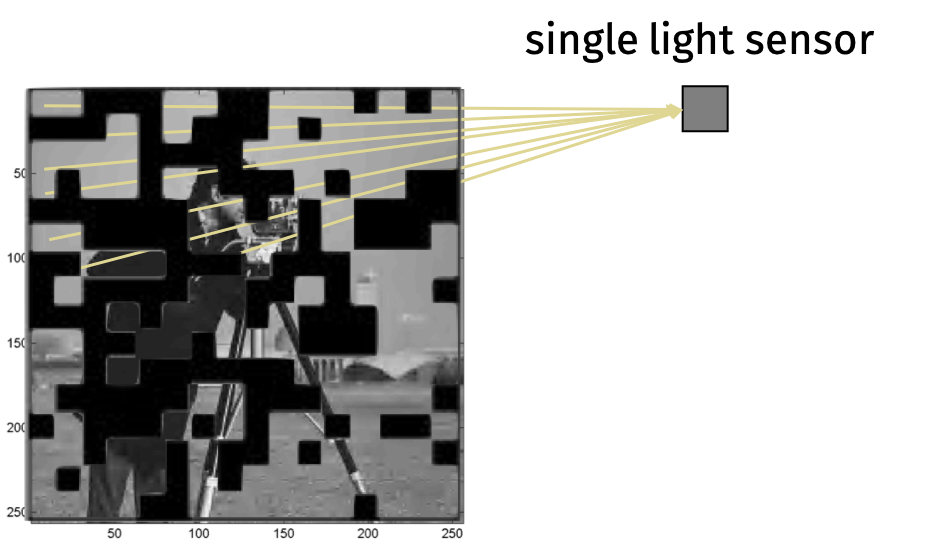

Last class, we discussed how to speed up regression using randomization.
Consider the feature matrix $\mathbf{A} \in \mathbb{R}^{n \times d}$ and target vector $\mathbf{b} \in \mathbb{R}^n$.
We wanted to find the least squares solution 
$$\mathbf{x}^* = \arg\min_{\mathbf{x} \in \mathbb{R}^d} \|\mathbf{Ax} - \mathbf{b}\|_2^2.$$
But solving the problem directly is expensive:
It would take $O(nd^2)$ time to compute the solution $\mathbf{x}^*=(\mathbf{A}^\top \mathbf{A})^{-1} \mathbf{A}^\top \mathbf{b}$
or $O(nd)\cdot(\# \text{iterations})$ time to compute the solution iteratively.

Instead, we used a random JL matrix $\mathbf{\Pi} \in \mathbb{R}^{m \times n}$ to reduce the dimension of the problem
and find
$$
\tilde{\mathbf{x}} = \arg\min_{\mathbf{x} \in \mathbb{R}^m} \|\mathbf{\Pi Ax} - \mathbf{\Pi b}\|_2^2.
$$
It would take $O(md^2)$ time to compute the solution 
$\tilde{\mathbf{x}}=(\mathbf{\Pi A}^\top \mathbf{\Pi A})^{-1} \mathbf{\Pi A}^\top \mathbf{\Pi b}$
or $O(md)\cdot(\# \text{iterations})$ time to compute the solution iteratively.

But even computing $\mathbf{\Pi A}$ is expensive.
Since $\mathbf{\Pi}$ is $m \times n$ and $\mathbf{A}$ is $n \times d$, it would take $O(mnd)=O(nd^2)$ time to compute the matrix product $\mathbf{\Pi A}$.

Our goal today is to develop faster Johnson-Lindenstrauss projections.

Typically, we use sparse or structured matrices instead of fully random JL matrices because they are faster to compute.

We will develop a method that reduces a vector $\mathbf{x} \in \mathbb{R}^n$ down to $m \approx \frac{\log(1/\delta)}{\epsilon^2}$ dimensions in $O(mn)$ time and guarantee that
$$
(1-\epsilon) \|\mathbf{x}\|_2^2 \leq \|\mathbf{\Pi x}\|_2^2 \leq (1+\epsilon) \|\mathbf{x}\|_2^2.
$$

Recall that once this bound is proven, linearity lets us preserve quantities like $\| \mathbf{y} - \mathbf{x} \|_2$ and $\| \mathbf{Ax} - \mathbf{b} \|_2$ for all $\mathbf{x}$.

Let $\mathbf{S} \in \mathbb{R}^{m \times n}$ be a random sampling matrix.
Every row contains a value $s=\sqrt{n/m}$ in a single location and is zero everywhere else.

If we take $m$ samples, then $\tilde{\mathbf{x}} = \mathbf{Sx}$ is a random projection that can be computed in $O(m)$ time.
But, there's an issue.
The approach only works well if $\mathbf{x}$ is "flat".

**Claim:**
If $\mathbf{x}_i ^2 \leq \frac{c}{n} \| \mathbf{x} \|_2^2$ for all $i$, then
$m = O(c \log(1/\delta) /\epsilon^2)$ samples suffice to preserve the $\ell_2$-norm within an $\epsilon$ multiplicative factor with probability $1-\delta$.

The claim follows from the standard Hoeffding inequality.

Unfortunately, we can't guarantee that $\mathbf{x}$ is flat.
However, we can multiply by a *mixing matrix* $\mathbf{M}$ which ensures it cannot be too concentrated in one place.

We will show a mixing matrix $\mathbf{M}$ that satisfies the following properties:

* $\| \mathbf{Mx} \|_2^2 = \|\mathbf{x}\|_2^2$ *exactly*.

* Every entry in $\mathbf{Mx}$ is bounded. That is, $[\mathbf{Mx}]_i^2 \leq \frac{c}{n} \| \mathbf{x} \|_2^2$ for some factor $c$.

* We can compute $\mathbf{Mx}$ in $O(n \log n)$ time.

Then we will multiply by a subsampling matrix $\mathbf{S}$ to reduce the dimension.
The final projection is

$$\mathbf{\Pi x} = \mathbf{SM x}.$$

Good mixing matrices should look random.
In fact, for $\mathbf{Mx}$ to preserve the $\ell_2$-norm of any $\mathbf{x}$ with high probability, $\mathbf{M}$ must be a random matrix.

We can see this starting from the observation that $\| \mathbf{Mx} \|_2^2 = \|\mathbf{x}\|_2^2$ so $\mathbf{M}$ must be an orthogonal matrix.
Since $\mathbf{M}$ is orthogonal, it has an inverse $\mathbf{M}^{-1}$.
Then we can solve for an $\mathbf{x}$ such that $\mathbf{e}_1 = \mathbf{Mx}$ where $\mathbf{e}_1$ is the first standard basis vector.
In particular, $\mathbf{x} = \mathbf{M}^{-1} \mathbf{e}_1$.
If $\mathbf{M}$ is known in advance, we can adversarily choose $\mathbf{x}$ to give concentrated mass to the first coordinate.
Our solution is to use a random mixing matrix $\mathbf{M}$ so that, with high probability, $\mathbf{Mx}$ is flat even if $\mathbf{x}$ is not.

We have argued that $\mathbf{M}$ must be a random orthogonal matrix.
But, for our approach to work, we need to be able to compute $\mathbf{Mx}$ quickly.
So we will use a *pseudorandom* matrix instead.

We will use the mixing matrix $\mathbf{M} = \mathbf{HD}$ where:

* $\mathbf{D} \in \mathbb{R}^{n \times n}$ is a diagonal matrix with the diagonal entries $\mathbf{D}_{i} = \pm 1$ chosen uniformly at random.

* $\mathbf{H} \in \mathbb{R}^{n \times n}$ is a Hadamard matrix.

The Hadamard matrix is an orthogonal matrix closely related to the discrete Fourier matrix.
It has three critical properties:

1. $\| \mathbf{Hx} \|_2^2 = \|\mathbf{x}\|_2^2$ *exactly*. Thus $\| \mathbf{HDx} \|_2^2 = \|\mathbf{Dx}\|_2^2 = \|\mathbf{x}\|_2^2$.

2. $\mathbf{Hx}$ can be computed in $O(n \log n)$ time.

3. All of the entries in $\mathbf{H}$ have the same magnitude.

We will assume that $n$ is a power of 2.
For $k=0,1,\ldots$, the $k$th Hadamard matrix $\mathbf{H}_k$ is defined recursively as

\begin{align*}
\mathbf{H}_0 &= \begin{bmatrix} 1 \end{bmatrix} \\
\mathbf{H}_1 &= \frac{1}{\sqrt{2}} \begin{bmatrix} 1 & 1 \\ 1 & -1 \end{bmatrix} \\
\mathbf{H}_2 &= \frac{1}{\sqrt{2}} \begin{bmatrix} \mathbf{H}_1 & \mathbf{H}_1 \\ \mathbf{H}_1 & -\mathbf{H}_1 \end{bmatrix} \\
\mathbf{H}_k &= \frac{1}{\sqrt{2}} \begin{bmatrix} \mathbf{H}_{k-1} & \mathbf{H}_{k-1} \\ \mathbf{H}_{k-1} & -\mathbf{H}_{k-1} \end{bmatrix}.
\end{align*}

The $n$ by $n$ Hadamard matrix has all entries equal to $\pm 1/\sqrt{n}$.

**Property 1:**
For any $k = 0,1,\ldots$, we have $\| \mathbf{H}_k \mathbf{x} \|_2^2 = \|\mathbf{x}\|_2^2$ for all $\mathbf{x} \in \mathbb{R}^n$.
That is, $\mathbf{H}_k$ is orthogonal.

We will show the property via induction.
Assume the property holds for $\mathbf{H}_{k-1}$ so $\mathbf{H}_{k-1}^\top \mathbf{H}_{k-1} = \mathbf{I}_{2^{k-1}}$.
Then
\begin{align*}
\mathbf{H}_k^\top \mathbf{H}_k
&= \frac{1}{\sqrt{2}} \begin{bmatrix} \mathbf{H}_{k-1}^\top & \mathbf{H}_{k-1}^\top \\ \mathbf{H}_{k-1}^\top & -\mathbf{H}_{k-1}^\top \end{bmatrix}
\frac{1}{\sqrt{2}} \begin{bmatrix} \mathbf{H}_{k-1} & \mathbf{H}_{k-1} \\ \mathbf{H}_{k-1} & -\mathbf{H}_{k-1} \end{bmatrix} \\
&= \frac{1}{2} \begin{bmatrix} \mathbf{H}_{k-1}^\top \mathbf{H}_{k-1} + \mathbf{H}_{k-1}^\top \mathbf{H}_{k-1} & \mathbf{H}_{k-1}^\top \mathbf{H}_{k-1} - \mathbf{H}_{k-1}^\top \mathbf{H}_{k-1} \\ \mathbf{H}_{k-1}^\top \mathbf{H}_{k-1} - \mathbf{H}_{k-1}^\top \mathbf{H}_{k-1} & \mathbf{H}_{k-1}^\top \mathbf{H}_{k-1} + \mathbf{H}_{k-1}^\top \mathbf{H}_{k-1} \end{bmatrix} \\
&= \frac{1}{2} \begin{bmatrix} 2\mathbf{I}_{2^{k-1}} & 0 \\ 0 & 2\mathbf{I}_{2^{k-1}} \end{bmatrix} = \mathbf{I}_{2^{k}}.
\end{align*}

**Property 2:**
We can compute $\mathbf{\Pi x} = \mathbf{S HDx}$ in $O(n \log n)$ time.

Notice that
\begin{align*}
\mathbf{H}_kx
&= \frac{1}{\sqrt{2}} \begin{bmatrix} \mathbf{H}_{k-1} & \mathbf{H}_{k-1} \\ \mathbf{H}_{k-1} & -\mathbf{H}_{k-1} \end{bmatrix} \begin{bmatrix} \mathbf{x}_a \\ \mathbf{x}_b \end{bmatrix} \\
&= \frac{1}{\sqrt{2}} \begin{bmatrix} \mathbf{H}_{k-1} \mathbf{x}_a + \mathbf{H}_{k-1} \mathbf{x}_b \\ \mathbf{H}_{k-1} \mathbf{x}_a - \mathbf{H}_{k-1} \mathbf{x}_b \end{bmatrix}
\end{align*}
where $\mathbf{x}_a$ and $\mathbf{x}_b$ are the first and second halves of $\mathbf{x}$.
Since we only need to compute $\mathbf{H}_{k-1} \mathbf{x}_a$ and $\mathbf{H}_{k-1} \mathbf{x}_b$ each once,$\mathbf{H}_k \mathbf{x}$ is $T(n) = 2T(n/2) + O(n) = O(n \log n)$.

**Property 3**:
The randomized Hadamard matrix $\mathbf{HD}$ is a good mixing matrix for smoothing out vectors.

The figure on the left is a Hadamard matrix $\mathbf{H}$ where blue squares are $\frac1{\sqrt{n}}$ and white squares are $-\frac1{\sqrt{n}}$.
The figure on the right is a randomized Hadamard matrix $\mathbf{HD}$.

Pseudorandom objects like this appear all the time in computer science.
For example, error correcting codes, efficient hash functions, and more.

We will prove the following.

**SHRT Mixing Lemma:**
Let $\mathbf{H}$ be an $n \times n$ Hadamard matrix and $\mathbf{D}$ be an $n \times n$ diagonal matrix with $\mathbf{D}_{ii} = \pm 1$ chosen uniformly at random.
For any $\mathbf{x} \in \mathbb{R}^n$, let $\mathbf{z} = \mathbf{HDx}$.
Then, with probability at least $1-\delta$, we have
$$
z_i^2 \leq \frac{c \log(n/\delta)}{n} \| \mathbf{z} \|_2^2
$$
for all $i$ where $c$ is a universal constant.

**Proof:**
Let $\mathbf{h}_i^\top$ be the $i$th row of $\mathbf{H}$. Then $z_i = \mathbf{h}_i^\top \mathbf{Dx}$ and
\begin{align*}
\mathbf{h}_i^\top \mathbf{D} = \frac{1}{\sqrt{n}} \begin{bmatrix} 1 & 1 & \cdots & - 1 & -1 \end{bmatrix}
\begin{bmatrix} \mathbf{D}_{1} \\ & \mathbf{D}_{2} \\ & & \ddots \\ & & & \mathbf{D}_{n} \end{bmatrix}
\end{align*}
where $D_1, \ldots, D_n$ are independent random variables with $D_j = \pm 1$ chosen uniformly at random.
Equivalently,
\begin{align*}
\mathbf{h}_i^\top \mathbf{D} = \frac{1}{\sqrt{n}} \begin{bmatrix} R_1 & R_2  & \ldots & R_n \end{bmatrix}
\end{align*}
where $R_1, \ldots, R_n$ are independent random variables with $R_j = \pm 1$ chosen uniformly at random.
Then
$z_i = \frac{1}{\sqrt{n}} \sum_{j=1}^n R_j x_j$.
Notice that $z_i$ is a random variable with mean 0 and variance $\frac{1}{n} \| \mathbf{x} \|_2^2$.

To see this, we can write
\begin{align*}
\mathbb{E} \left[ z_i \right]
= \frac{1}{\sqrt{n}} \sum_{j=1}^n x_j \mathbb{E} \left[ R_j \right] = 0
\end{align*}
and, by linearity of variance,
\begin{align*}
\textrm{Var} \left[ z_i \right]
= \frac{1}{n} \sum_{j=1}^n x_j^2 \textrm{Var} \left[ R_j \right] = \frac{1}{n} \sum_{i=1}^n x_i^2 = \frac{1}{n} \| \mathbf{x} \|_2^2.
\end{align*}

We will apply a Bernstein type concentration inequality to prove the bound.

**Rademacher Concentration:**
Let $R_1, \ldots, R_n$ be independent random variables with $R_j = \pm 1$ chosen uniformly at random.
Then, for any $t > 0$ and vector $\mathbf{a} \in \mathbb{R}^n$, we have
$$
\Pr \left(
\sum_{i=1}^n R_i a_i \geq t \| \mathbf{a} \|_2
\right)
\leq e^{-t^2/2}.
$$

This inequality is called the Khintchine inequality.
It is specialized to sums of scaled $\pm 1$'s and is a bit tighter and easier to apply than the generic Bernstein bound.

Applying the inequality, we have, with probability $1-\delta$,
\begin{align*}
z_i \leq \sqrt{ \frac{c \log(n/\delta)}{n} \|} \mathbf{x} \|_2 = \sqrt{ \frac{c \log(n/\delta)}{n} \|} \mathbf{z} \|_2
\end{align*}
where the second equality follows because multiplying by $\mathbf{H}$ and $\mathbf{D}$ preserve the $\ell_2$-norm.
As shown earlier, we can thus guarantee that
$$
(1-\epsilon) \| \mathbf{z} \|_2^2 \leq \| \mathbf{Sz} \|_2^2 \leq (1+\epsilon) \| \mathbf{z} \|_2^2
$$
as long as $\mathbf{S} \in \mathbb{R}^{m \times n}$ is a subsampled randomized Hadamard transform with $m = O\left(\frac{\log(n/\delta) \log(1/\delta)}{\epsilon^2}\right)$.

We have
$\| \mathbf{Sz} \|_2^2 = \| \mathbf{SHDx} \|_2^2 = \| \mathbf{\Pi x} \|_2^2$
and $\| \mathbf{z} \|_2^2 = \| \mathbf{x} \|_2^2$ so we are done.

In words, the SHRT mixing lemma shows that the mixed vector is very close to uniform with high probability.
As we saw earlier, we can therefore argue that
$\| \mathbf{S z} \|_2^2 \approx \| \mathbf{z} \|_2^2.$

The main result then follows directly from our sampling result.

**Fast JL Lemma:**
Let $\mathbf{\Pi} = \mathbf{SHD} \in \mathbb{R}^{m \times n}$ be a subsampled randomized Hadamard transform with $m = O\left(\frac{\log(n/\delta) \log(1/\delta)}{\epsilon^2}\right)$.
Then, for any fixed $\mathbf{x}$, we have
$$
(1-\epsilon) \| \mathbf{x} \|_2^2 \leq \| \mathbf{\Pi x} \|_2^2 \leq (1+\epsilon) \| \mathbf{x} \|_2^2
$$
with probability $1-\delta$.

We can apply the theorem to regression.
We compute $\mathbf{\Pi A}$ in $O(nd \log n)$ time instead of $O(nd^2)$ time.
This is because there are $d$ columns and each column can be computed in $O(n \log n)$ time.
The result is quite impressive because there are only $O(nd)$ entries in $\mathbf{A}$ so the projection is nearly linear.

However, we may want to go faster when $\mathbf{A}$ is sparse.
For this setting, Clarkson and Woodruff in 2013 [showed](https://arxiv.org/abs/1207.6365) that we can compute $\mathbf{\Pi A}$ with an ultra-sparse matrix in $O(\text{nnz}(\mathbf{A}))$ time
where $\text{nnz}(\mathbf{A})$ is the number of non-zero entries in $\mathbf{A}$.
The proofs use totally different techniques than the Johnson-Lindenstrauss and $\epsilon$-net arguments we used.

We covered this algorithm because it is simple and easy to implement.
The algorithm has also been used for accelerating vector dimensionality reduction, linear algebra, locality sensitive hasing, and randomized kernel learning methods.

### Sparse Recovery

The Hadamard transform is closely related to the Discrete Fourier Transform $\mathbf{F} \in \mathbb{C}^{n \times n}$.
The DFT is defined on complex numbers
$$
\mathbf{F}_{j,k} = e^{-2\pi i \frac{j k}{n}}
$$
where $i$ is the imaginary unit.
The DFT is a unitary matrix so $\mathbf{F}^* \mathbf{F} = \mathbf{I}$ where $\mathbf{F}^*$ is the conjugate transpose of $\mathbf{F}$.

Using the same divide-and-conquer algorithm as the Hadamard matrix, we can compute $\mathbf{Fy}$ the DFT of the vector $\mathbf{y}$ in $O(n \log n)$ time.

The real part of the $j,k$ entry is $\cos(2\pi j k)$ so the $j$th row of $\mathbf{F}$ looks like a cosine wave with frequency $j$.
Computing $\mathbf{Fy}$ computes inner products of $\mathbf{y}$ with many different frequencies, which can be used to decompose the vector into a sum of those frequencies.

The figure hints at the intuition behind the uncertainty principle: a vector and its DFT cannot both be concentrated.

As we saw before, sampling does not preserve norms when $\mathbf{y}$ has a few large entries.
Taking the Fourier transform, just like taking the Hadamard transform, eliminates the hard case without changing the norm.
Because of this property, the Fourier transform is one of the central tools in sparse recovery (also sometimes called compressed sensing).

The goal in sparse recover is to recover a vector $\mathbf{x}$ from linear measurements.
We can choose $\mathbf{A} \in \mathbb{R}^{m \times n}$ with $m < n$.
Assume we can access the *measurement* $\mathbf{b} = \mathbf{Ax}$.
We will try to recover $\mathbf{x}$ from $\mathbf{b}$.

Since $m < n$, there are infinitely many vectors $\mathbf{x}$ that satisfy $\mathbf{Ax} = \mathbf{b}$.

However, we can hope to recover $\mathbf{x}$ if we know that $\mathbf{x}$ has some additional structure.

We'll consider an example in photography.
Typically, cameras acquire images by measuring the intensity of light with one sensor per pixel.

We could instead imagine a camera that measures the intensity of light with just one sensor.

If the pixel intensities are $\mathbf{x} \in \mathbb{R}^n$, then the single pixel returns
$$
b = \frac1{n} \sum_{i=1}^n x_i 
= \begin{bmatrix} \frac1{n} & \frac1{n} & \cdots & \frac1{n} \end{bmatrix} \mathbf{x}
\begin{bmatrix} x_1 \\ x_2 \\ \vdots \\ x_n \end{bmatrix}
$$
which is not very much information about the image.
But we can get more information from other linear measurements via masking.

Let
$$
b_i = \frac1{n} \sum_{j \in S_i} x_j
= \begin{bmatrix} 0 & \frac1{n} & \cdots & 0 \end{bmatrix} \begin{bmatrix} x_1 \\ x_2 \\ \vdots \\ x_n \end{bmatrix}.
$$
If we take enough measurements $b_i$, then we can recover the whole image.

There are applications of this approach in imaging outside of the visible spectrum, microscopy, and other scientific imaging.
The theory we will discuss does not exactly describe these problems but it has been very valuable in modeling them.

We will make an assumption to solve the problem.
In particular, we will assume that $\mathbf{x}$ is $k$-sparse for small $k$ i.e., $\| \mathbf{x} \|_0 \leq k$.
In many cases, we can recover $\mathbf{x}$ with roughly $O(k)$ measurements.

It is natural to ask whether sparsity is a reasonable assumption.
For some of the approaches we will discuss, it suffices to assume that $\mathbf{x}$ is sparse in any known basis.
For example, images tend to have repeating patterns which can be sparse in the Fourier basis.
In fact, JPEG compression is based on this idea.

Even under this assumption, there are some matrices $\mathbf{A}$ that will not allow us to recover $\mathbf{x}$.
For example, if $\mathbf{A}$ has repeated columns then we cannot distinguish between the entries of $\mathbf{x}$ that correspond to those columns.

There are several ways to formalize the property that $\mathbf{A}$ allows us to recover $\mathbf{x}$:

* $\mathbf{A}$ has Kruskal rank $r$ if all sets of $r$ columns are linearly independent.

* $\mathbf{A}$ is $\mu$-incoherent if $|\mathbf{A}_{i}^\top \mathbf{A}_j | \leq \mu \|\mathbf{A}_i \|_2 \| \mathbf{A}_j \|_2$ for all distinct columns $i,j$.

Today, we will consider matrices that satisfy the RIP.

**Restricted Isometry Property (RIP):**
$\mathbf{A}$ satisfies the $(q,\epsilon)$-Restricted Isometry Property (RIP) if $(1-\epsilon) \| \mathbf{x} \|_2^2 \leq \| \mathbf{Ax} \|_2^2 \leq (1+\epsilon) \| \mathbf{x} \|_2^2$ for all $q$-sparse vectors $\mathbf{x}$.

Notice that RIP is a Johnson-Lindenstrauss type condition.
A matrix $\mathbf{A}$ that is $(q, \epsilon)$-RIP preserves the norm of all $q$-sparse vectors as opposed to the norms of a discrete set of vectors or all vectors in a subspace (as in subspace embeddings).

Matrices that are satisfy RIP are not too rare, random Johnson-Lindenstrauss matrices (e.g., Gaussian, sign) with $m=O\left(\frac{k \log(n/k}{\epsilon^2}\right)$ rows are $(k, \epsilon)$-RIP.

**$\ell_0$-Minimization Theorem:**
Suppose we are given $\mathbf{A} \in \mathbb{R}^{m \times n}$ and $\mathbf{b} = \mathbf{Ax}$ for an unknown $k$-sparse $\mathbf{x} \in \mathbb{R}^n$.
If $\mathbf{A}$ is $(2k,\epsilon)$-RIP for any $\epsilon< 1$, then $\mathbf{x}$ is the unique minimizer of
$$
\min_{\mathbf{z} \in \mathbb{R}^n} \| \mathbf{z} \|_0 \quad \textrm{subject to} \quad \mathbf{Az} = \mathbf{b}.
$$

The theorem establishes that *information theoretically* we can recover $\mathbf{x}$ from $\mathbf{b}$.
However, solving the $\ell_0$-minimization problem is computationally difficult, requiring $O(n^k)$ time.
We will address a faster method shortly.

**Proof:**
By contradiction, assume there is some $\mathbf{y} \neq \mathbf{x}$ with $\mathbf{Ay} = \mathbf{b}$ and $\| \mathbf{y} \|_0 \leq \| \mathbf{x} \|_0$.

We know that
\begin{align*}
\mathbf{A}(\mathbf{y} - \mathbf{x}) =
\mathbf{Ay} - \mathbf{Ax} 
= \mathbf{b} - \mathbf{b} = 0
\end{align*}
so 
$\| \mathbf{A(y-x)} \|_2 = 0$.
But $\mathbf{y-x}$ is $2k$-sparse and $\mathbf{A}$ is $(2k,\epsilon)$-RIP so
\begin{align*}
(1-\epsilon) \| \mathbf{y-x} \|_2^2 \leq \| \mathbf{A(y-x)} \|_2^2 \leq (1+\epsilon) \| \mathbf{y-x} \|_2^2
\end{align*}
but this is a contradiction since $\| \mathbf{y-x}\|_2 > 0$ and $\| \mathbf{A(y-x)}\|_2 = 0$

There are robust versions of the $\ell_0$-minimization theorem.
These are more important in practice because they are more stable to noise.
Here's a flavor of the results:
Suppose $\mathbf{b} = \mathbf{A}(\mathbf{x} + \mathbf{e})$ where $\mathbf{x}$ is $k$-sparse $\mathbf{e}$ is dense but has bounded norm.
Then we can recover some $k$-sparse $\tilde{\mathbf{x}}$ such that $$\| \mathbf{x} - \tilde{\mathbf{x}} \|_2 \leq \|\mathbf{e}\|_2.$$

We will not discuss robustness in detail.
But, along with computational considerations, it is a big part of what has made compressed sensing such an active research area in the last two decades.
There are non-robust compressed sensing results that have been known for a long time.
For example, compressed sensing was discussed in the 1795 paper by Gaspard Riche de Prony titled *Essai experimental et analytique: sur les lois de la dilatabilite des fluides elastique et sur celles de la force expansive de la vapeur de l'eau et de la vapeur de l'alkool, a differentes temperatures.*

In many applications, we can compute measures of the form $\mathbf{Ax} = \mathbf{SFx}$ where $\mathbf{F}$ is the DFT matrix and $\mathbf{S}$ is a subsampling matrix.
Recall that $\mathbf{F}$ decomposes $\mathbf{x}$ into different frequencies which tends to be sparse depending on the application.
Then $\mathbf{Ax}$ is a subset of rows from $\mathbf{F}$ then $\mathbf{Ax}$ is a subset of random frequency components from the DFT of $\mathbf{x}$.
In many scientific applications, we can collect entries of $\mathbf{Fx}$ one at a time for some unobserved data vector $\mathbf{x}$.

**Medical Imaging (MRI):**
How do we measure entries of the Fourier transform $\mathbf{Fx}$ for an MRI? We blast the body with sound waves of varying frequency.
If we can reduce the number of measurements, we can reduce the time the patient spends in the machine and the energy use of the procedure.

**Geophysics:**
How do we measure entries of the Fourier transform $\mathbf{Fx}$ for geophysical analysis? We blast the ground with sound waves of varying frequency (e.g.,using airguns, controlled explosions, and vibrations from drilling).
If we can reduce the number of measurements, we can make the data acquisition process cheaper and less disruptive.

Setting $\mathbf{A}$ to contain $m=\left( \frac{k \log^2 k \log n}{\epsilon^2} \right)$ random rows of a discrete Fourier matrix $\mathbf{F}$ yields a matrix that satisfies $(k, \epsilon)$-RIP with high probability.
In spirit, the proof requires similar tools to analyze subsampled Hadamard transforms!
Many brilliant mathematicians have worked on this problem including Guruswami, Bourgain, Veryshinin, and Tao.

Amazing, we can actually prove a version of this result with only a slightly worse bound.
We'll start with the observation
that the $k$-sparse vectors $\mathbf{x}$ that can be written as $\mathbf{Ax}$ lie in a union of $k$-dimensional subspaces.

We'll use the following subspace embedding theorem that we proved previously.

**Subspace Embedding Theorem**
Let $\mathcal{U} \subset \mathbb{R}^n$ be a $k$-dimensional subspace.
If $\mathbf{\Pi}$ is chosen from any distribution satisfying the distributional JL Lemma, then with probability $1-\delta$,
$$
(1-\epsilon) \| \mathbf{y} \|_2^2
\leq \| \mathbf{\Pi} \mathbf{y} \|_2^2
\leq (1+\epsilon) \| \mathbf{y} \|_2^2
$$
for all $\mathbf{y} \in \mathcal{U}$ as long as $m = O \left( \frac{k + \log(1/\delta)}{\epsilon^2} \right)$.

We will use union bound to apply this theorem to a collection of linear subspaces.
Let $\mathcal{S}_k = \{ \mathbf{x} \in \mathbb{R}^n : \|\mathbf{x}\|_0 \leq k \}$ be the set of all $k$-sparse vectors.
We can write $\mathcal{S}_k$ as a union of disjoint $q$-dimensional subspaces $\mathcal{S}_k = \mathcal{U}_1 \cup \ldots \mathcal{U}_T$.
The number of subspaces $T$ is the number of ways to choose $k$ coordinates from $n$ coordinates, which is $T = \binom{n}{k}$.
Consider all $k$-sparse vectors $\mathbf{x} \in \mathbb{R}^n$.
We can partition the set by which coordinates are non-zero.
For one set of non-zero coordinates, we only need to preserve the basis vectors for that set of coordinates.
Therefore $T$ is the number of ways to choose $q$ coordinates from $n$ coordinates, which is $T = \binom{n}{k}$.

We'll apply union bound to all $T$ subspaces.
In particular, we'll set $\delta' = \frac{\delta}{T}$ and apply the subspace embedding theorem with failure probability $\delta'$.
It remains to analyze
\begin{align*}
\log(1/\delta') &= \log(1/\delta) + \log(T) \\
&= \log(1/\delta) + \log \left( \frac{n!}{k!(n-k)!} \right) \\
&\approx \log(1/\delta) + k \log \left( \frac{n}{k} \right).
\end{align*}
We won't prove the approximate equality but you can [check](https://en.wikipedia.org/wiki/Binomial_coefficient#Bounds_and_asymptotic_formulas) that
\begin{align*}
\left( \frac{n}{k} \right)^k \leq \binom{n}{k} \leq \left( \frac{en}{k} \right)^k.
\end{align*}

Then we have the following.

**Theorem:**
Let $\mathcal{U} \subset \mathbb{R}^n$ be a $k$-dimensional linear subspace.
If $\mathbf{\Pi} \in \mathbb{R}^{m \times n}$ is chosen from any distribution $\mathcal{D}$ satisfying the distributional JL lemma, then with probability $1-\delta$,
$$
(1-\epsilon) \| \mathbf{x} \|_2^2 \leq \| \mathbf{\Pi x} \|_2^2 \leq (1+\epsilon) \| \mathbf{x} \|_2^2
$$
for all $\mathbf{x} \in \mathcal{U}$ as long as
$m = O\left( \frac{k\log(n) + \log(1/\delta)}{\epsilon^2} \right)$.
