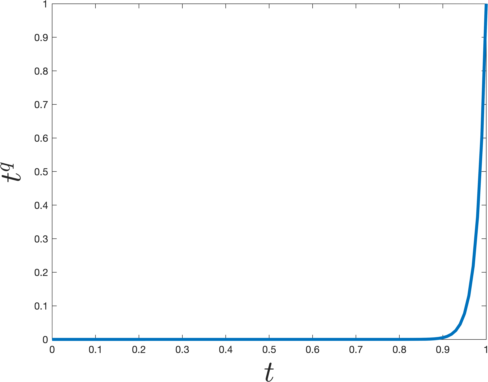
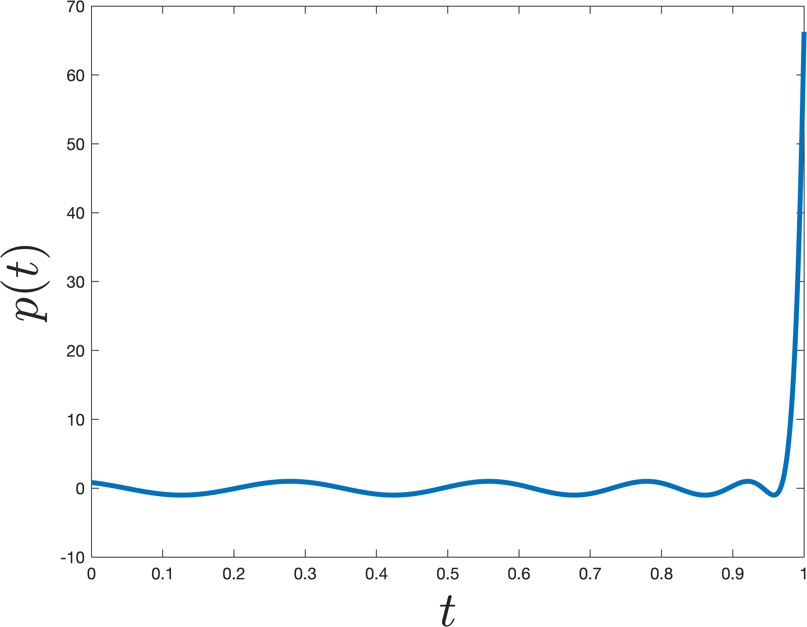

### Power Method Recap

#### Description of the Method

In class, we analyzed the power method for computing the top right singular vector, $\vec{v}_1$, of a matrix $X \in \R^{n\times d}$ with  singular value decomposition $X = U\Sigma V^T$. The method when as followed:

**Power Method:**

* Choose $\vec{z}^{(0)}$ randomly. E.g. $\vec{z}^{(0)} \sim \mathcal{N}(0,1)$.
* $\vec{z}^{(0)} = \vec{z}^{(0)} /\|\vec{z}^{(0)}\|_2$
* For $i = 1,\ldots, q$
  * $\vec{z}^{(i)} = X^T{X}\vec{z}^{(i-1)} )$
  * $n_i = \|\vec{z}^{(i)}\|_2$
  * $\vec{z}^{(i)}  = \vec{z}^{(i)}/n_i$
* Return $\vec{z}^{(q)}$

In other words,  each of our iterates $\vec{z}^{i}$ is simply a scaling of  a column in the following matrix:
$$
K = \begin{bmatrix} \vec{z}^{(0)} & A\vec{z}^{(0)} & A^2 \vec{z}^{(0)} & A^3\vec{z}^{(0)} \ldots A^q \vec{z}^{(0)}\end{bmatrix},
$$
where $A = X^TX$. Typically we run $q \ll d$ iterations, so $K$ is a tall, narrow matrix. The span of $K$'s columns is called a **Krylov subspace** because it is generated by starting with a single vector $\vec{z}^{(0)}$ and repeatedly multiplying by a fixed matrix $A$. We will return to $K$ shortly. 

#### Analysis Preliminaries 

Let $\vec{v}_1, \ldots, \vec{v}_d$ be the right singular vectors of $X$ (the columns of $V$). We write each iterate in terms of this basis of vectors:
$$
\begin{align*}
\vec{z}^{(0)} &= c_1^{(0)}\vec{v}_1 + {c}_2^{(0)}\vec{v}_2 + \ldots + c_d^{(0)} \vec{v}_d \\
		\vec{z}^{(1)} &= c_1^{(1)}\vec{v}_1 + {c}_2^{(1)}\vec{v}_2 + \ldots + c_d^{(1)} \vec{v}_d\\
		&\vdots\\
		\vec{z}^{(q)} &= c_1^{(q)}\vec{v}_1 + {c}_2^{(i)}\vec{v}_2 + \ldots + c_d^{(q)} \vec{v}_d
\end{align*}
$$

Note that $c_j^{(i)} = \langle \vec{z}^{(i)}, v_i\rangle$. Intuitively, we expect the relative size of $c_1^{(i)}$ to **increase**  in comparison to the other coefficients as $i$ increases, which is good because then  $\vec{z}^{(q)}$ will start looking more and more like $\vec{v}_1$. Why do we expect this? Because $\vec{z}^{(i)} = \frac{1}{n_i}A^q \vec{z}^{(i-1)}$ and thus we can check that $c_j^{(i)} = \frac{1}{n_i}\sigma_j^2 c^{(i-1)}_j$. The $\frac{1}{n_i}$ term is fixed for all $j$, but the $\sigma_j^2$ term will be largest for $j=1$, and thus the $c_1^{(i)}$ will increase in size more than any other term. We will analyze this formally soon.

First however, let's see what it suffices to prove.

**Claim 1**: If $c_j^{(q)}/c_1^{(q)} \leq \sqrt{\epsilon/d}$ for all $j\neq 1$ than either $\|\vec{v}_1 -\vec{z}^{(q)}\|_2^2\leq 2\epsilon$ or $\|-\vec{v}_1 - \vec{z}^{(q)}\|_2^2\leq 2\epsilon$ . 

*Proof.* Since $c_1^{(q)} \leq 1$, the above would imply that $c_j^{(q)} \leq \sqrt{\epsilon/d}$.  Since $\sum_{k=1}^d \left(c_k^{(q)}\right)^2 = 1$ it follows that $\left(c_1^{(q)}\right)^2 \geq (1-\epsilon)$ and thus $\left|c_1^{(q)}\right| \geq 1-\epsilon$. Then for any unit vector $\vec{x}$ we have $\|\vec{x} -\vec{z}^{(q)}\|_2 = 2 - 2\langle\vec{x},\vec{z}^{(q)}\rangle$. Since  $\langle\vec{v}_1,\vec{z}^{(q)}\rangle = c_1^{(q)}$ we conclude that either $\langle\vec{v}_1,\vec{z}^{(q)}\rangle \geq 1-\epsilon$ or  $\langle- \vec{v}_1,\vec{z}^{(q)}\rangle \geq 1-\epsilon$. Suppose without loss of generality it's the first: $\langle\vec{v}_1,\vec{z}^{(q)}\rangle \geq 1-\epsilon$. Then  we would conclude that $\|\vec{v}_1 -\vec{z}^{(q)}\|_2 = 2 - 2\langle\vec{v}_1,\vec{z}^{(q)}\rangle \leq 2 - 2\cdot (1-\epsilon) = 2\epsilon$. $\square$ 

So, to show power methods converges, our goal is to prove that $\left|c_j^{(q)}/c_1^{(q)}\right| \leq \sqrt{\epsilon/d}$ for all $j\neq 1$. 

#### Heart of the Analysis 

To prove this bound, we note that $c_j^{(q)} = S\cdot \sigma_j^{2q} c_j^{(0)}$ for any $j$ and $c_1^{(q)} = S\cdot \sigma_1^{2q} c_1^{(0)}$ where $S = 1/\prod_{i=1}^q n_i$ is some fixed scaling. So:
$$
\left|\frac{c_j^{(q)} }{c_1^{(q)} }\right| = (\sigma_j/\sigma_1)^{2q} \left|\frac{c_j^{(0)} }{c_1^{(0)} }\right|.
$$
As claimed in class (and can be prove as an exercise -- try using rotational invariance of the Gaussain ) if $z^{(0)}$ is a randomly initialized start vector,   $\left|\frac{c_j^{(0)} }{c_1^{(0)} }\right| \leq d^{3}$ with high proability. That may see like a lot, but $(\sigma_j/\sigma_1)^{2q}$ is going to be tiny number, so will easily cancel that out. In particular, 
$$
(\sigma_j/\sigma_1)^{2q} = \left(1-\frac{\sigma_1-\sigma_j}{\sigma_1}\right)^{2q} \leq (1-\gamma)^{2q},
$$
where $\gamma = \frac{\sigma_1-\sigma_2}{\sigma_1}$ is our spectral gap parameter. As long as we set 
$$
q = \frac{\log(d^3\sqrt{d/\epsilon})}{\gamma} = O\left(\frac{\log(d/\epsilon)}{\gamma}\right),
$$
then $(1-\gamma)^{2q} \leq \frac{\sqrt{\epsilon/d}}{d^3}$, and thus 
$$
\left|\frac{c_j^{(q)} }{c_1^{(q)} }\right| = (\sigma_j/\sigma_1)^{2q} \left|\frac{c_j^{(0)} }{c_1^{(0)} }\right| \leq d^3\cdot \frac{\sqrt{\epsilon/d}}{d^3} \leq \sqrt{\epsilon/d},
$$
as desired.

#### Alternative Guarantee

In machine learning applications, we care less about actually approximating $\vec{v}_1$, and more that the $\vec{z}$ is a "good top singular vector" in that it offers a good rank-1 approximation to $X$. I.e., we want to prove that $$\|X - X\vec{z}\vec{z}^T\|_F^2 = \|X\|_F^2 - \|X\vec{z}\vec{z}^T\|_F^2$$ is small, or equivalently, that $$\|X\vec{z}\vec{z}^T\|_F^2$$ is large. The largest it could be is $\|X\vec{v}_1\vec{v}_1^T\|_F^2 = \sigma_1^2$. And from the same argument above, where we claimed that  either $\langle\vec{v}_1,\vec{z}^{(q)}\rangle \geq 1-\epsilon$ or  $\langle- \vec{v}_1,\vec{z}^{(q)}\rangle \geq 1-\epsilon$, it is not hard to check that $$\|X\vec{z}\vec{z}^T\|_F^2 \geq (1-\epsilon)^2 \sigma_1^2$$, so after 
$O\left(\frac{\log(d/\epsilon)}{\gamma}\right)$ we get a near optimal low-rank approximation. 

### The Lanczos Method	

We will now see how to improve on power method using what is known as the Lanczos method. Like power method, Lanczos is considered a **Krylov subspace method** because it will return a solution **in the span of the Krylov subspace** that we introduced before. Power method clearly does this -- it returns a scaling of the last column of $K$. The whole idea behind Lanczos is to avoid "throwing away'" information from earlier columns like power method, but instead to take advantage of the whole space. It turns at that doing so can be very helpful -- we will get a bound that depends on $1/\sqrt{\gamma}$ instead of $1/\gamma$. 

Specifically, to definte the Lanczos method, we will let $Q\in \R^{d\times k}$ be a matrix with orthonormal columns that spans $K$. In practice, you need to be careful about how this is computed for numerical stability reasons, but we won't worry about that for now. Imagine your computer has infinite precision and we just compute $Q$ by orthonormalizing $K$. 

**Lanczos Method**

* Compute an orthonormal span $Q$ for the degree $q$ Krylov subspace. 
* Let $\vec{z}$ be the top eigenvector of $Q^TA{Q} = {Q}^T{X}^T{X}{Q}$ 
* Return $Q\vec{z}$. 

Importantly, the first step only requires $q$ matrix-vector multiplications with $X^TX$, each of which can be implemented in $O(nd)$ time, just like we did for power method. The second step might look a bit circular at first glance. We want an approximation algorithm for computing the top eigenvector of ${X}^TX$ and the above method uses a top eigenvector algorithm as a subroutine. But note that $Q^TA{Q}$ only has size $q\times q$, where $q\ll d$ is our iteration count. So even if it's too expensive to compute a direct eigendecomposition of $X^TX$, ${Q}^T{X}^T{X}{Q}$ can be computed in $O(ndq) + O(dq^2) + O(q^3) + O(ndq)$ time (the first part is the time to construct $Q$ and $XQ$, the second to compute ${Q}^T{X}^T{X}{Q}$, and the third to find its top eigenvector using a direct method).

#### Analysis Preliminaries 

Our first claim is that Lanczos returns the *best* approximate singular vector in the span of the Krylov subspace. Then we will argue that there always exists *some* vector in the span of the subspace that is significantly better than what power method returns, so the Lanczos solution must be significantly better as well.  

**Claim 2**: Amongst all vectors in the span of the Krylov subspace (i.e., any vector $\vec{y}$ that can be written as $\vec{y} = Q\vec{x}$ for some $x\in \R^k$), $\vec{y}^* = Q\vec{z}$ minimizes the low-rank approximation error $\|X - X\vec{y}\vec{y}^T\|_F^2$. 

*Proof.* First, we can prove that $\vec{y}$ should always be chosen to have unit norm, so that $\vec{y}\vec{y}^T$ is a projection. Accordingly, it must also be that $\vec{x} = Q^T\vec{y}$ has unit norm. Then, proving the claim above is equivalent to proving that $\vec{y}^* = {Q}\vec{z}$ maximizes $\|X\vec{y}\vec{y}^T\|_F^2 = \|X\vec{y}\|_F^2 = \|X\vec{y}\|_2^2 = \|XQ\vec{x}\|_2^2$. It is not hard to check that setting $\vec{x}$ to be the maximum right singular vector of ${X}{Q}$ maximizes this $\|XQ\vec{x}\|_2^2$ amongst all unit vectors, and this right singular vector is the same at the top eigenvector of $Q^TX^TXQ$. 

**Claim 3**: I f we run the Lanczos method for $O\left(\frac{\log(d/\epsilon)}{\sqrt{\gamma}}\right)$ There is *some* vector $\vec{w}$ of the form $\vec{w} = Q\vec{x}$ such that either either $\langle\vec{v}_1,\vec{w}\rangle \geq 1-\epsilon$ or  $\langle- \vec{v}_1,\vec{w}\rangle \geq 1-\epsilon$. 

In other words, there is some $\vec{w}$ in the Krylov subspace that has a large inner product with the true top singular vector $\vec{v}_1$. As seen earlier for power method, this can be used to prove that e.g. $\|X\vec{w}\vec{w}^T\|_F^2$ is large, and from **Claim 2**, we know that the $\vec{v}$ returned by Lanczos can only do better. So, we focus on proving **Claim 3**. 

#### Heart of the Analysis 

The key idea is to observe that any vector in the span of the Krylov subspace of size $q$ -- i.e. any vector $\vec{w}$ that can be written $\vec{w} = Q\vec{x}$  is equal to:
$$
\vec{w} = p(A)\vec{z}^{(0)},
$$
for some **degree q polynomial** $p$. For example, we might have $p(A) = 2A^2 - 4A^3 + A^6$ or $p(A) = I - A - 10A^5$. And moreover, for any degree $q$ polynomial $p$, there is *some* $\vec{x}$ such that  $Q\vec{x} = p(A)\vec{z}^{(0)}$. To see that this is true, we note that all of the monomials $\vec{z}^{(0)}, A\vec{z}^{(0)}, \ldots, A^q\vec{z}^{(0)}$ lie in the span of $Q$, so any linear combination does as well. 

This means that showing there is a good approximate top singular vector $\vec{w}$ in the span of the Krylov subspace can be reduced to finding a **good polynomial $p(A)$**. Specifically, notice that, if we write $p(A)\vec{z}^{(0)}$ in the span of the singular vectors we have:
$$
p(A)\vec{z}^{(0)} = g_1 \vec{v}_1 + g_2 \vec{v}_2 + \ldots + g_d \vec{v}_d
$$
where
$$
g_j = c_j^{(0)}p(\sigma_j^2).
$$
Our goal, which is exactly the same as when we analyzed power method, is to show that $g_1$ is *much larger* than $g_j$ for all $j \neq 1$.  In other words we want to find a polynomial such that $p(t)$ is small for all values of  $0\leq t< \sigma_1^2$, but then the polynomial should suddenly **jump** to be large at $$\sigma_1$$. The simplest degree $q$ polynomial that does this is $p(t) = t^q$. However, it turns out there are more *sharply* jumping polynomials, which can be obtained by shifting/scaling a type of polynomials known as a [Chebyshev polynomial](https://en.wikipedia.org/wiki/Chebyshev_polynomials). An example that jumps at $\sigma_1^2 = 1$ is shown below. The difference from $t^q$ is pretty remarkable -- even though the polynomial $p$ shown below is nearly as small for all $0\leq t< 1$, it is much larger at $t=1$. 

Concretely we can claim the following, which is a bit tricky to prove, but well known (see [Lemma 5 here](https://arxiv.org/pdf/1504.05477.pdf) for a full proof).

**Claim 4:** There is a degree $O\left(\sqrt{\frac{1}{\gamma}}\log\frac{1}{\epsilon}\right)$ degree polynomial $\hat{p}$ such that $\hat{p}(1) = 1$ and  $|p(t)| \leq \epsilon$ for $0 \leq t \leq 1-\gamma$. 

In contrast, to ensure that $t^q$ satisfies the above, we would need degree q = $O\left({\frac{1}{\gamma}\log\frac{1}{\epsilon}}\right)$ -- a quadratically worse bound. This is what will account for the quadratic difference in performance between the Lanczos and Power Methods. 

The fact that there exist much steeper low-degree polynomails than $t^q$ is the sort of thing studied in the mathematical field known as Approximation Theory. That might see pretty obscure, but steep polynomials are surprisingly useful in computer science, appearing everywhere from [classic](https://dl.acm.org/doi/10.1145/129712.129757), to [Quantum complexity theory](https://arxiv.org/pdf/quant-ph/9802049.pdf), to [learning theory](http://www.cs.columbia.edu/~rocco/Public/stoc01.pdf). If you're interested in learning more about this, check out slides for this [talk](http://people.cs.georgetown.edu/jthaler/QuICSslides.pdf).

#### Finishing Up

Finally, we use **Claim 4** to finish the analysis of Lanczos. Consider the vector $\hat{p}\left(\frac{1}{\sigma_1^2}A\right)\vec{z}^{(0)}$, which as argued above lies in the Krylov subspace. As discussed below equation (7), our job is to prove that:
$$
\frac{c_j^{(0)}\hat{p}\left(\frac{1}{\sigma_1^2}\sigma_j^2\right)}{c_1^{(0)}\hat{p}\left(\frac{1}{\sigma_1^2}\sigma_1^2\right)} \leq \sqrt{\epsilon/d},
$$
for all $j \neq i$, as long as $\hat{p}$ is chosen to have degree $q = O\left(\sqrt{\frac{1}{\gamma}}\log\frac{d}{\epsilon}\right)$ 

Consider the numerator first. $\frac{\sigma_j^2}{\sigma_1^2} = \left(\frac{\sigma_j}{\sigma_1}\right)^2 = \left(1 - \left(1-\frac{\sigma_j}{\sigma_1}\right)\right)^2 = \left(1 - \frac{\sigma_1 - \sigma_j}{\sigma_1}\right)^2 \leq (1-\gamma)^2 \leq (1-\gamma)$ .

 Accordingly, if we set $q = O\left(\sqrt{\frac{1}{\gamma}}\log\frac{1}{\epsilon'}\right)$  where $\epsilon' = \sqrt{\epsilon/d}/d^3$,  then $\hat{p}\left(\frac{1}{\sigma_1^2}\sigma_j^2\right) \leq \epsilon'$. And the denomenator is simply equal to $c_1^{(0)}\hat{p}(1) =  c_1^{(0)}\cdot 1$. So, since $c_j^{(0)}/c_1^{(0)}\leq d^3$ with high probability, as argued earlier, (9) holds. And thus **Claim 3** is proven by setting $\vec{w} = \hat{p}\left(\frac{1}{\sigma_1^2}A\right)\vec{z}^{(0)}$.

